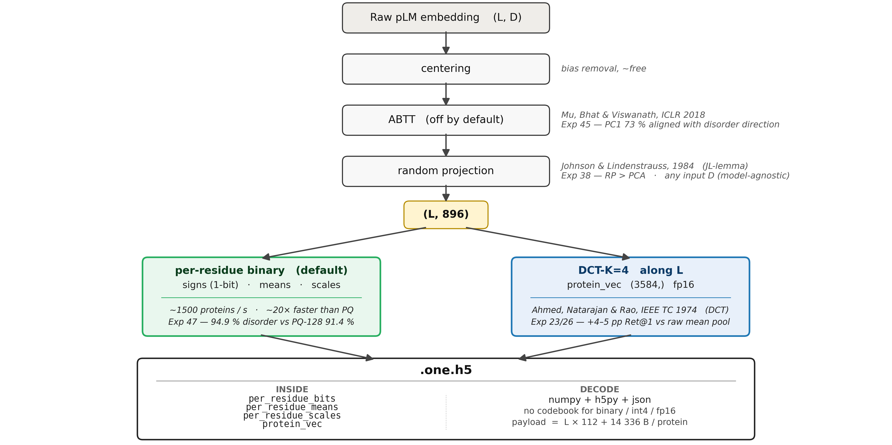

# OneEmbedding — universal codec for PLM per-residue embeddings

A single Python class that compresses any of five major protein language model (PLM) outputs by **~37× at 95–100 % task retention** across 4 task families and 9 datasets, with rigorous BCa confidence intervals throughout. Default mode (binary) needs **no codebook** — the receiver decodes with `numpy + h5py` in ~12 lines.

| | |
|---|---|
| **Compression\*** | ~37× vs fp32 raw (binary, default) — also int4 (9×), PQ M=224 (18×), fp16 (2.3×), lossless (2×) |
| **Retention** | 95–100 % across SS3, SS8, retrieval, disorder on 5 PLMs |
| **Storage** | ~17 KB / protein at L=156 mean (binary 896d) |
| **Receiver deps** | `numpy + h5py` only for binary / int4 / fp16; PQ requires codebook |
| **PLMs validated** | ProtT5-XL, ProstT5, ESM-C 600M, ANKH-large, ESM2-650M |
| **Tests** | 813 passing |
| **License** | MIT |

> <a id="compression-note"></a>**\* What 37× means in practice.** The headline ratio is the **asymptote for long proteins** in binary mode, vs raw fp32. Two things shift it on real data:
>
> - **Per-PLM:** the ratio scales with input width. For ESM2 (D=1280) the asymptote is ~45×; for ProtT5 (D=1024) it is ~37×. Bigger native dimension → more compression at the same `d_out=896` target.
> - **Per-length:** every `.one.h5` protein carries a fixed-cost header (DCT-K=4 protein vector + per-residue means/scales). For long proteins this header is amortised and the realised ratio approaches the asymptote; **for very short proteins (L≲30) the realised ratio is closer to ~10×**.
> - **If you strip the per-protein header** (e.g. for storage-only workloads that don't need the protein vector) and ship the dataset-shared elements once rather than per protein, the per-residue ratio goes well past the headline number. The headline above is the conservative, self-contained-file ratio.
>
> Asymptote derivation: `(input_bits × D_in / D_out) / quant_bits` — fp32 → 1-bit gives 32 × 1024/896 = 36.6× for ProtT5, 32 × 1280/896 = 45.7× for ESM2. **Realistic compression vs typical fp16 storage is half of each number** (16-bit input instead of 32-bit).

---

## How it works



Centering and random projection are training-free and PLM-agnostic. ABTT is off by default — Exp 45 showed PC1 is ~73 % aligned with the disorder direction, so removing it costs 6–11 pp of disorder retention. Quantization runs per residue (binary by default, PQ/int4/fp16 optional); a DCT-K=4 protein vector is computed along the length axis for retrieval.

---

## How to use

### Install

```bash
git clone <repo-url> ProteEmbedExplorations
cd ProteEmbedExplorations
uv sync --all-extras --all-groups   # installs deps + dev tooling
uv run pytest tests/                # 813 tests should pass
```

### Encode

```python
from src.one_embedding.codec_v2 import OneEmbeddingCodec

codec = OneEmbeddingCodec()        # default: 896d binary, ~37× compression, no codebook
codec.fit(training_embeddings)     # dict of {pid: (L, D) np.ndarray} — for centering stats only

encoded = codec.encode(raw_embedding)             # raw shape (L, D) → compressed dict
codec.save(encoded, "protein.one.h5")             # ~17 KB at L=156

# Or batch via H5:
codec.encode_h5_to_h5("raw_embeddings.h5", "compressed.one.h5")
```

### Decode (binary default — `numpy + h5py` only, no codebook)

A batch file (`encode_h5_to_h5` output) stores one group per protein with
`per_residue_bits`, `per_residue_means`, `per_residue_scales`, and a
`protein_vec` summary. File-level metadata sits in a JSON blob in
`f.attrs["metadata"]`. The receiver:

```python
import json, h5py, numpy as np

with h5py.File("compressed.one.h5", "r") as f:
    meta   = json.loads(f.attrs["metadata"])  # codec settings (d_out, version, ...)
    g      = f["P12345"]                       # one protein per group
    bits   = g["per_residue_bits"][:]          # uint8, shape (L, ceil(D/8))
    means  = g["per_residue_means"][:]         # (D,)
    scales = g["per_residue_scales"][:]        # (D,)
    L      = int(g.attrs["seq_len"])
    D      = int(meta["d_out"])

unpacked = np.unpackbits(bits, axis=1, bitorder="big")[:, :D]
signs    = unpacked.astype(np.float32) * 2 - 1   # {0,1} → {-1,+1}
per_res  = signs * scales + means                 # (L, D) reconstructed, float32
```

That's the whole receiver path for the default binary mode — no
`OneEmbeddingCodec` import, no codebook, just NumPy + h5py + json. Single-protein
files written by `codec.save()` use the same datasets at file-level instead of
inside a per-protein group; drop the `g = f["P12345"]` line. PQ mode requires
the codebook; int4 and fp16 follow the same shape with different unpacking.

### Try it on real data

```bash
uv run python demo/build.py     # 10 CASP12 proteins → raw / mean_pool / ours
uv run python demo/show.py      # prints the on-disk sizes of all three forms
cat demo/README.md              # walks through what's in each form
```

### Configuration knobs

| Knob | Default | Range | Notes |
|------|---------|-------|-------|
| `d_out` | 896 | 256–4096 | RP target dimension. Set to PLM `D` to skip RP entirely. |
| `quantization` | `'binary'` | `None`/`'int4'`/`'pq'`/`'binary'` | Per-residue storage. `None` = fp16. |
| `pq_m` | `auto` | divisor of `d_out` | PQ subquantizers; auto = largest factor ≤ `d_out//4`. |
| `abtt_k` | 0 | 0–`d_out` | Top-PC removal. Off by default — Exp 45 showed PC1 destroys disorder signal. |

Three sane presets:

- **Default** — `OneEmbeddingCodec()` → 896d binary, ~37×, no codebook, ~1500 prot/s.
- **Max quality** — `OneEmbeddingCodec(quantization='pq', pq_m=224)` → 18×, codebook required, slower encode.
- **Lossless** — `OneEmbeddingCodec(d_out=1024, quantization=None)` → 2×, fp16, no projection.

---

## How well it works


Five PLMs, four task families, all retentions in 94.8–102.6 %. Same train/test partition is applied per PLM (single split file, embeddings re-extracted per model). All cells bit-perfect against `data/benchmarks/rigorous_v1/exp46_multi_plm_results.json`.

### Single-PLM sweep (Exp 47, ProtT5-XL, BCa CIs in source JSONs)

| Config | Compression | SS3 ret | SS8 ret | Ret@1 ret | Disorder ret |
|--------|:-----------:|:-------:|:-------:|:---------:|:------------:|
| lossless 1024d | 2× | 100.2 % | 100.0 % | 100.4 % | 100.0 % |
| fp16 896d | 2.3× | 100.0 % | 99.2 % | 100.6 % | 98.6 % |
| int4 896d | 9× | 99.8 % | 98.8 % | 100.4 % | 98.2 % |
| **PQ M=224 896d** *(max quality)* | **18×** | **99.0 %** | **98.5 %** | **100.6 %** | **95.4 %** |
| PQ M=128 896d | 32× | 97.5 % | 96.1 % | 100.1 % | 91.4 % |
| **binary 896d** *(default)* | **37×** | **97.6 %** | **95.0 %** | **100.4 %** | **94.9 %** |

Compression ratios in this table are vs raw fp32 at the asymptote (long ProtT5 proteins). See [the compression note](#compression-note) above for per-PLM and per-length caveats.

### Multi-PLM validation (numbers behind the heatmap)

| PLM | dim | SS3 ret | SS8 ret | Ret@1 ret | Disorder ret |
|-----|:---:|:-------:|:-------:|:---------:|:------------:|
| ProstT5 | 1024 | 99.2 ± 0.3 % | 98.6 ± 0.5 % | 100.0 ± 0.5 % | 98.3 ± 1.1 % |
| ProtT5-XL | 1024 | 99.0 ± 0.5 % | 98.5 ± 0.6 % | 100.6 ± 0.6 % | 95.4 ± 1.9 % |
| ESM-C 600M | 1152 | 98.3 ± 0.5 % | 97.6 ± 0.7 % | 102.6 ± 2.9 % | 98.1 ± 1.0 % |
| ANKH-large | 1536 | 97.9 ± 0.5 % | 96.3 ± 0.8 % | 99.9 ± 0.6 % | 94.8 ± 2.3 % |
| ESM2-650M | 1280 | 97.6 ± 0.7 % | 96.5 ± 0.7 % | 97.8 ± 1.6 % | 98.8 ± 0.9 % |

---

## Related work

OneEmbedding is a **storage / transport** codec. Methods at adjacent layers:

- **[TEA](https://www.biorxiv.org/content/10.1101/2025.11.27.690975v2)** (Pantolini et al., bioRxiv 2025) — 20-letter alphabet from contrastive ESM2 head, plugs into vanilla MMseqs2 for sequence-style remote-homology search. Solves the "MMseqs2 on embeddings" question; OneEmbedding does not compete, the two layer cleanly.
- **[Foldseek / 3Di](https://www.nature.com/articles/s41587-023-01773-0)** (van Kempen et al., 2024) — structural-alphabet baseline; complementary to OneEmbedding (requires structures).
- **[RNS](https://www.nature.com/articles/s41592-026-02651-5)** (Prabakaran & Bromberg, Nat Methods 2026) — per-protein embedding-quality metric; we use it under compression in Exp 48.

Full notes in [`docs/related-work.md`](docs/related-work.md).

---

## What's not (yet) solved

These open problems are explicit and surface in the talk:

1. **Disorder retention plateaus at ~95 %** — the geometric Exp 45 finding (PC1 ↔ disorder direction) explains why ABTT-style preprocessing doesn't help and why uniform quantization can't fully recover. **Exp 51 (PolarQuant) tested and rejected:** adding a per-residue magnitude scalar on top of binary does not move disorder retention (94.4 ± 1.9 % vs 94.9 ± 1.8 %, CIs overlap). The gap is from sign-quantization noise on *direction*, not magnitude loss — three extra bits per dim (int4) recover most of it. There is no "polar shortcut" at 1 bit per dim. See `docs/exp51_polarquant.md`. Multi-teacher distillation is the remaining angle worth trying.
2. **Sequence → binary OE prediction is capacity-bound at ~69 %** bit accuracy (Exp 50 Stages 1–3 all converge there). **Stage 4 (transformer)** is the architecture lever; designed but not yet executed.
3. **No co-distilled VESM baseline yet** — VESM (Bromberg lab, 2026) is the strongest plausible competitor; weights are public.
4. **VEP / ProteinGym evaluation missing** — the classical PLM-quality benchmark; earmarked.
5. **PQ as a "learned filter" — open follow-up.** Exp 48c found that PQ M=64 *exceeds* raw ProtT5 at DCT-K=4 RNS (Δ = −0.028 vs raw, sig.) — the PQ codebook fit on real residues snaps junkyard residues onto real-protein-like centroids, re-introducing a corpus-direction bias post-centering. Worth investigating whether the same mechanism could be turned on disorder, where uniform quantization plateaus at ~95 % retention. Connects naturally to (1).

---

## Repo layout

```
src/one_embedding/      Codec + research library
  codec_v2.py           OneEmbeddingCodec (the shipping class)
  quantization.py       binary / int4 / PQ implementations + decoders
  preprocessing.py      centering, ABTT, RP
  transforms.py         DCT, Haar, spectral
  io.py                 .one.h5 / .oemb format read/write
  cli.py                CLI (Click-based)
  ...

src/evaluation/         Benchmarks (retrieval, probes, structural)
src/extraction/         PLM embedding extraction (HuggingFace wrappers)
src/training/           Trainers (ChannelCompressor, MLP-AE, contrastive)
src/utils/              Device management (MPS / CPU / CUDA), H5 I/O

experiments/            47 numbered experiments, each self-contained
  43_rigorous_benchmark/  The Nature-level methodology (BCa, paired, CV-tuned)
  44_unified_codec_benchmark.py
  45_disorder_forensics.ipynb  ABTT-PC1 ↔ disorder geometry
  46_multi_plm_benchmark.py    5-PLM validation
  47_codec_sweep.py            Single-PLM sweep across configs
  50_sequence_to_oe.py         Sequence → binary OE prediction (in-progress)

tests/                  813 tests (pytest)

demo/                   3-form demo (raw / mean_pool / ours) on 10 CASP12 proteins

docs/
  EXPERIMENTS.md          Full 200+ method enumeration across 47 experiments
  figures/                README + paper figures
```

---

## Tools (work in progress)

A small set of utilities ships under `src/one_embedding/tools/` for operating
directly on compressed embeddings. **They are usable but rough** — most of the
trained probe weights were fit against earlier 512d / 768d codec configurations
and have not yet been retrained against the current 896d binary default. Tools
auto-detect the input dimension and fall back to dimension-agnostic heuristics
when no matching weights exist; expect the heuristic fallback for the 896d
default until probes are retrained.

| tool | what it does | status |
|------|--------------|:------:|
| `tools/disorder.py` | per-residue disorder prediction (CheZOD-style CNN probe) | trained at 512d / 768d; 896d falls back to norm heuristic |
| `tools/ss3.py` | 3-state secondary structure (CB513-style probe) | same as above |
| `tools/classify.py` | protein-level classification (DeepLoc-style) | trained probe at 768d |
| `tools/search.py` | kNN retrieval over compressed embeddings | dimension-agnostic — works on any `d_out` |
| `tools/align.py` | pairwise sequence-via-embedding alignment | dimension-agnostic |
| `tools/conserve.py` | residue-level conservation score | heuristic; no probe yet |
| `tools/mutate.py` | mutation effect scoring | heuristic; no probe yet |
| tree construction (Exp 35) | Bayesian phylogeny from embedding distances (Brownian-motion MCMC, warm-started from per-protein consensus) | **exploratory, experiment-only** — runs as `experiments/35_embedding_phylogenetics.py`, not yet packaged as a `tools/` entry; tested on a 12-family benchmark, no claims of replacing established sequence-tree methods |

For task-quality numbers under the current 896d binary default, refer to the
benchmark JSONs in `data/benchmarks/rigorous_v1/` (Exp 43 / 44 / 46 / 47 — the
audit-grounded protocol). The tools are convenience wrappers; the rigorous
numbers come from the experiment scripts.

---

## Reproducibility

```bash
uv sync --all-extras --all-groups   # installs torch, transformers, faiss-cpu, tmtools, marp, ruff, etc.
uv run pytest tests/                # 813 / 813 should pass on M3 Max
uv run deptry .                     # "No dependency issues found"
```

To regenerate the headline single-PLM table:

```bash
# Pre-extracted ProtT5 embeddings live in data/residue_embeddings/ (see Exp 01 to regenerate)
uv run python experiments/47_codec_sweep.py --plm prot_t5_full
```

The 5-PLM validation requires extracting all 5 PLMs first (~1–2 days on M3 Max for the full datasets); see `experiments/01_extract_residue_embeddings.py`.

### Hardware notes

- Validated on MacBook Pro M3 Max (96 GB), MPS backend.
- CUDA path tested in fixtures, not benchmarked at scale.
- All tensors `float32` (MPS does not support `float64`); `torch.linalg.svdvals` requires CPU on MPS.

---

## Citation

Manuscript in preparation. Until then:

```bibtex
@misc{oneembedding2026,
  title  = {OneEmbedding: a universal codec for protein-language-model embeddings},
  author = {<TBD>},
  year   = {2026},
  url    = {https://github.com/<TBD>/ProteEmbedExplorations}
}
```

---

## Acknowledgements

This codec stands on top of:
- **ProtT5 / ProstT5** (Heinzinger, Elnaggar et al., Rost lab)
- **ESM2 / ESM-C** (Lin, Hayes et al., Meta FAIR)
- **ANKH** (Elnaggar et al.)
- **NetSurfP-2.0** (Klausen et al.) for SS3/SS8 datasets
- **SETH / CheZOD / TriZOD** (Dass, Haak et al.) for disorder
- **CATH / SCOPe / DeepLoc** for retrieval and localisation
- The **Rost lab** for the rigorous-benchmarking conventions adopted throughout
- **Bromberg lab's RNS / VESM work** (companion direction; integration earmarked)

License: MIT (see `LICENSE`).
