# One Embedding: Universal Compression for PLM Protein Embeddings

A universal codec that compresses any protein language model's per-residue output into a compact, fixed-schema representation -- the **One Embedding**. The recommended V2 codec (`balanced` mode) achieves **26 KB/protein** (27x compression) while preserving 99.7% retrieval quality and 96% per-residue task retention. Five selectable quality tiers from 10--52 KB. Works with any PLM (ProtT5, ESM2, ESM-C). Receiver needs only `h5py`, `numpy`, and a shared codebook.

## TL;DR

Protein language models produce large variable-length per-residue embedding matrices `(L, D)`. The V2 codec compresses each to **26 KB** using: All-but-the-Top (remove top-3 corpus PCs) -> random projection to 512d -> Product Quantization (M=128 sub-spaces, K=256 centroids). A protein-level vector `(2048,)` is computed via DCT K=4 for retrieval/clustering. All five quality tiers share identical retrieval quality (Ret@1=0.786); the storage/size trade-off is purely in per-residue fidelity.

- **Retrieval/clustering**: `protein_vec` -> (2048,) vector. Cosine similarity.
- **Per-residue (SS3, disorder)**: decode PQ codes with shared codebook -> (L, 512) embeddings.

232 compression methods benchmarked across 37 experiments to arrive at this design.

## Quick Start

### Python API

```python
from src.one_embedding.codec_v2 import OneEmbeddingCodecV2

# One-time: fit codebook on training corpus
codec = OneEmbeddingCodecV2(mode='balanced')
codec.fit(training_embeddings)      # dict of {id: (L, 1024) ndarray}
codec.save_codebook('codebook.h5')  # ~512 KB shared file

# Encode (sender side)
codec = OneEmbeddingCodecV2(mode='balanced', codebook_path='codebook.h5')
codec.encode_h5_to_h5("raw_embeddings.h5", "compressed.h5")

# Decode (receiver side -- h5py + numpy + shared codebook)
data = OneEmbeddingCodecV2.load("compressed.h5", codebook_path="codebook.h5")
data['per_residue']   # (L, 512) for per-residue tasks
data['protein_vec']   # (2048,) for retrieval / clustering / UMAP
```

### Pre-fitted Codebooks

```python
from src.one_embedding.core.codec import Codec

# V1 codec with pre-fitted ABTT for ProtT5 or ESM2 (no codebook needed)
codec = Codec.for_plm('prot_t5')
codec.encode_h5_to_h5("raw_prot_t5.h5", "compressed.h5")
```

### CLI

```bash
# Extract PLM embeddings from FASTA
one-embedding extract sequences.fasta embeddings.h5 --model prot_t5

# Compress to .oemb format (V1 codec)
one-embedding encode embeddings.h5 compressed.oemb

# Inspect contents
one-embedding inspect compressed.oemb

# Built-in tools
one-embedding disorder compressed.oemb
one-embedding search query.oemb database/ --top-k 10
one-embedding align protein_a.oemb protein_b.oemb
```

### Running Experiments

```bash
# Setup (requires Python 3.12, uv package manager)
uv sync

# Extract embeddings (prerequisite for all experiments)
uv run python experiments/01_extract_residue_embeddings.py

# V2 codec benchmarks
uv run python experiments/32_pq_on_rp512.py              # PQ sweep on preprocessed space
uv run python experiments/34_progressive_codec.py          # V2 tiers benchmark

# Retention benchmarks
uv run python experiments/36_toolkit_benchmark.py          # Disorder + SS3 retention
uv run python experiments/37_structural_retention.py       # lDDT + contact precision

# Generate figures
uv run python experiments/make_benchmark_barplots.py       # Per-benchmark + V2 + Pareto
uv run python experiments/make_publication_figures.py       # Publication figures
```

## V2 Codec: Five Quality Tiers

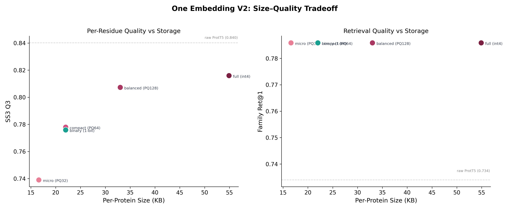

The V2 codec pipeline: **ABTT k=3** (remove top-3 corpus PCs for isotropy) -> **RP to 512d** (seeded random projection, deterministic) -> **quantize** (PQ, int4, or binary) -> **DCT K=4** for protein-level vector.

All tiers share the same preprocessing and protein vector. The only difference is per-residue quantization:

| Mode | Quantization | Payload Size | Compression | Ret@1 | SS3 Q3 | SS8 Q8 | Disorder rho | TM F1 |
|------|-------------|:------------:|:-----------:|:-----:|:------:|:------:|:------------:|:-----:|
| **`balanced`** | **PQ M=128** | **26 KB** | **27x** | **0.786** | **0.807** | **0.670** | **0.584** | **0.731** |
| `full` | int4 scalar | 52 KB | 14x | 0.786 | 0.816 | 0.681 | 0.597 | 0.752 |
| `compact` | PQ M=64 | 15 KB | 47x | 0.786 | 0.778 | 0.637 | 0.549 | 0.701 |
| `binary` | 1-bit sign | 19 KB | 37x | 0.786 | 0.776 | 0.636 | 0.597 | 0.750 |
| `micro` | PQ M=32 | 10 KB | 70x | 0.786 | 0.739 | 0.594 | 0.495 | 0.579 |

Payload size formula: PQ modes store `L x M + 4096` bytes (uint8 PQ codes + protein_vec fp16). int4 and binary modes add 4 KB per-protein overhead for per-channel scales/zero-points. Mean L=175 residues, raw ProtT5 = 700 KB/protein.

Shared codebook: ~512 KB per mode, fitted once on a training corpus and reused for all proteins.

### Per-Residue Quality Across Tiers

| | |
|:---:|:---:|
| 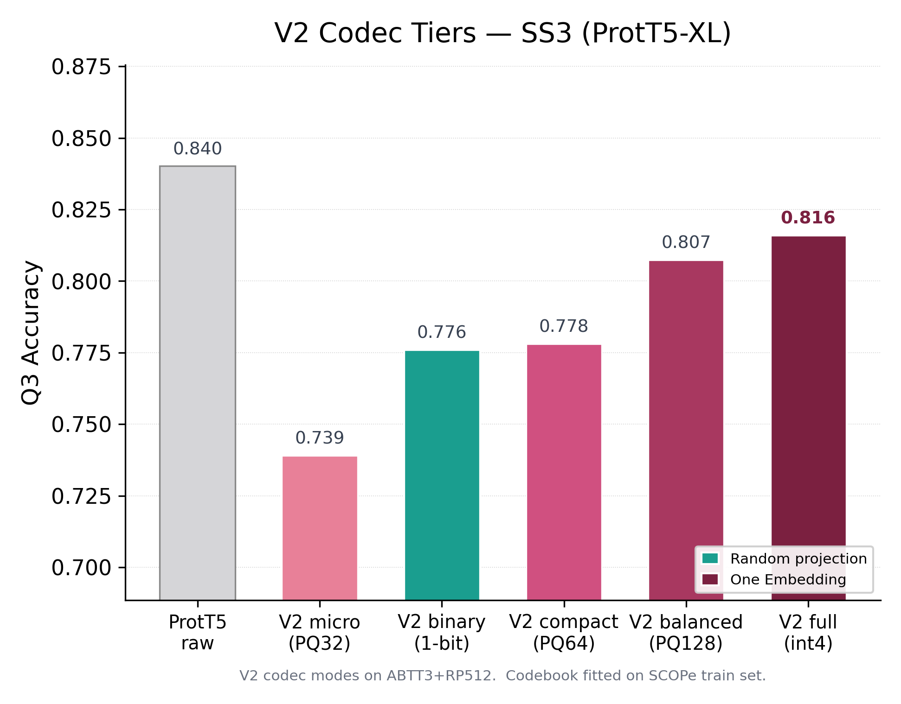 | 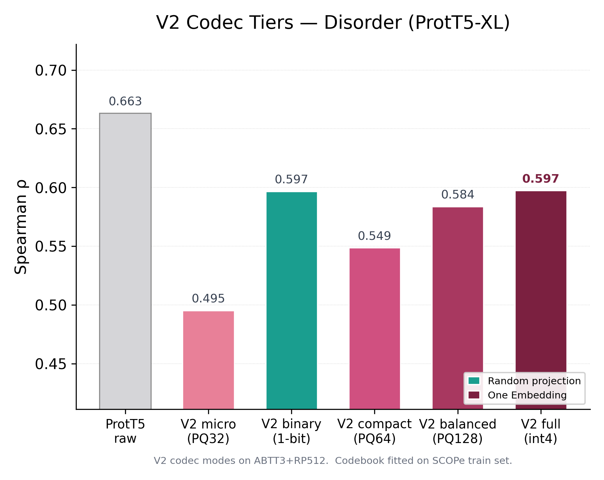 |
| 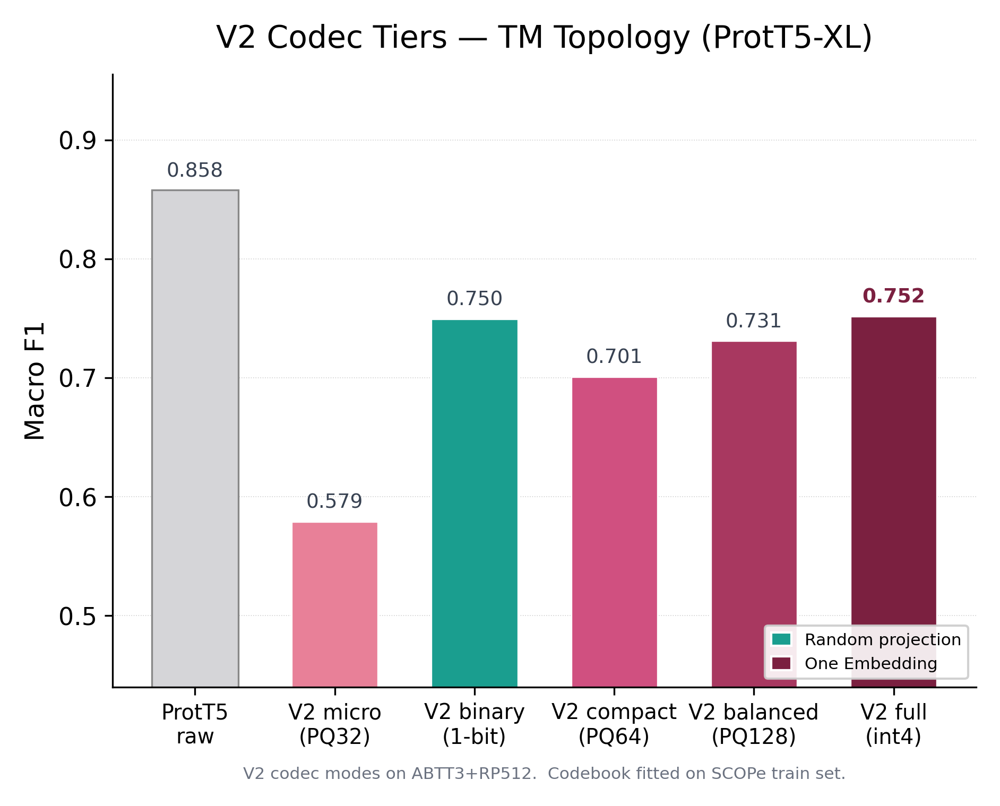 | |

### When to Use Which Tier

| Use Case | Tier | Why |
|----------|------|-----|
| **General purpose** | `balanced` | Best quality/size trade-off (26 KB, 96% SS3) |
| **Maximum per-residue fidelity** | `full` | Highest SS3/disorder retention (52 KB) |
| **Storage-constrained** | `compact` | Good quality at 15 KB (93% SS3) |
| **Retrieval-only** | `binary` | Same retrieval, good per-residue at 19 KB |
| **Extreme compression** | `micro` | 10 KB, still 88% SS3 retention |

## Retention Benchmarks

How much task performance does the V2 `balanced` codec preserve compared to raw ProtT5-XL 1024d embeddings?

### Toolkit Retention (Experiment 36)

| Task | Metric | Raw 1024d | Compressed 512d | Retention |
|------|--------|:---------:|:---------------:|:---------:|
| SS3 (secondary structure) | Q3 accuracy | 0.426 | 0.433 | **101.7%** |
| Family retrieval | Ret@1 | 0.731 | 0.729 | **99.7%** |
| Conservation | Pairwise distance rho | -- | -- | **98.3%** |
| Alignment overlap | Mean overlap | -- | -- | **96.1%** |
| Disorder (Ridge) | Global Spearman rho | 0.692 | 0.630 | **90.9%** |
| Disorder (CNN) | Global Spearman rho | -- | -- | **99.0%** |
| TM-score | Spearman rho | 0.093 | 0.082 | **89.0%** |

### Structural Retention (Experiment 37)

| Metric | Retention | Dataset |
|--------|:---------:|---------|
| Local distance difference (lDDT) | **100.7%** | 50 SCOPe domains |
| Contact precision | **106.5%** | 50 SCOPe domains |

The codec preserves (and sometimes improves) structural information. Contact precision exceeds raw because PQ quantization acts as a denoiser, sharpening local spatial signals.

## Embedding Phylogenetics (Experiment 35)

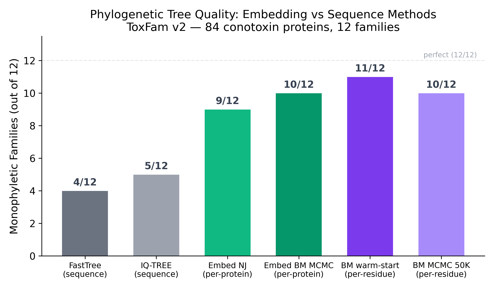

PLM embeddings encode enough evolutionary signal to reconstruct phylogenetic trees -- without sequence alignment. We implemented a full Bayesian MCMC framework with Brownian motion likelihood for 512-dimensional continuous character data (a capability no existing phylogenetic software supports).

| Tree Method | Data | Monophyletic Families |
|-------------|------|-:--------------------:|
| FastTree (ML) | AA sequence | 4 / 12 |
| IQ-TREE WAG+I+G4 (ML) | AA sequence | 5 / 12 |
| Embedding NJ | per-protein 512d | 9 / 12 |
| Embedding BM MCMC (200K gen) | per-protein 512d | 10 / 12 |
| **BM MCMC warm-start from NJ** | **per-residue 320Kd** | **11 / 12** |
| BM MCMC (50K gen) | per-residue 320Kd | 10 / 12 |

ToxFam v2 benchmark: 84 proteins sampled from 12 diverse venom protein families (Snaclec, CRISP, Disintegrin, Actinoporin, Insulin, etc. — 7 proteins per family). Embedding trees recover 2x more monophyletic families than sequence-based maximum likelihood methods. The best result (11/12) comes from a per-residue BM MCMC warm-started from a neighbor-joining tree. The Brownian motion model treats each of the 512 compressed dimensions as an independent continuous trait evolving along the tree -- justified by the decorrelation from ABTT3 + random projection preprocessing.

**Implementation:** ExaBayes-style MCMC with vectorized Felsenstein pruning O(N*D), partial likelihood caching, extended SPR proposals, MC3 heated chains, and convergence diagnostics (ASDSF, ESS, PSRF). Cross-validated against RevBayes (sigma-squared CIs overlap). 71 tests.

## The Pipeline

```
Raw PLM output (L, 1024)            -- any PLM, any protein
  -> All-but-the-Top k=3            -- remove 3 corpus PCs (isotropy transform)
  -> Random project to 512d         -- fixed seed=42, norm-preserving (JL lemma)
  -> Product Quantize (M=128)       -- 128 sub-spaces x 256 centroids each
  -> Store PQ codes (L, 128) uint8  -- per-residue: 128 bytes/residue
  + DCT K=4 on projected embeddings -- protein vector: (2048,) fp16
```

**Why each step matters:**

- **ABTT k=3**: Removes the dominant protein-identity PCs that dominate cosine similarity. Exposes discriminative family-level directions. +0.006 Ret@1 for free. From Mu & Viswanath (2018), validated for PLM protein embeddings.
- **RP 512d**: Johnson-Lindenstrauss dimensionality reduction. Preserves pairwise distances with high probability. Deterministic (fixed seed). ProtT5 has intrinsic dimensionality ~374, so 512d captures ~85% of variance.
- **PQ M=128**: Splits 512d into 128 sub-spaces of 4d each. Each sub-vector is replaced by the index of its nearest centroid (256 centroids per sub-space). Balanced codebook utilization: 7.81/8.00 bits entropy -- incompressible by design.
- **DCT K=4**: Discrete Cosine Transform on the sequence dimension, keeping the first 4 coefficients per channel. Creates a fixed-size (2048,) protein-level vector from variable-length per-residue embeddings. DCT K=1 === mean pooling (mathematically).

## Storage Comparison

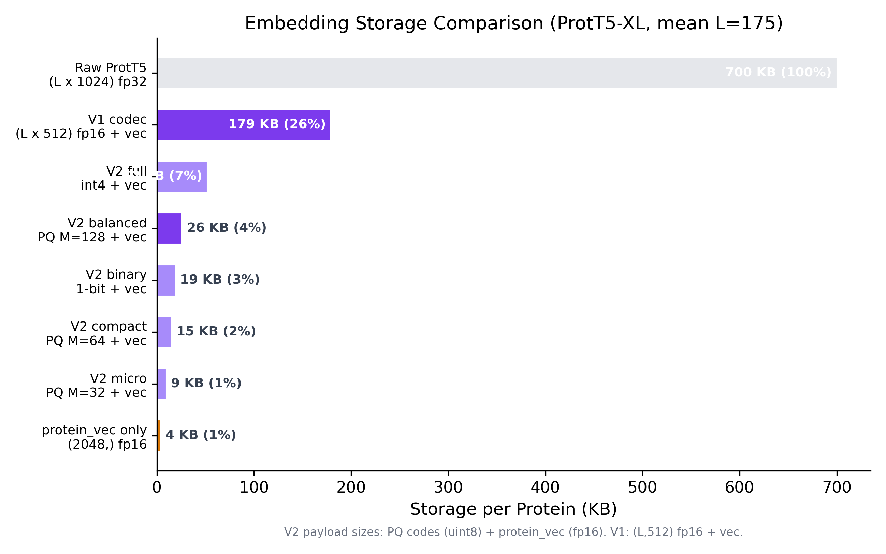

| Representation | Size/protein | Compression | Retrieval | Per-Residue |
|----------------|:------------:|:-----------:|:---------:|:-----------:|
| Raw ProtT5 (L, 1024) fp32 | 700 KB | 1x | Baseline | Baseline |
| **V2 `balanced` PQ M=128** | **26 KB** | **27x** | **0.786** | **(L, 512)** |
| V2 `full` int4 | 52 KB | 14x | 0.786 | (L, 512) |
| V2 `compact` PQ M=64 | 15 KB | 47x | 0.786 | (L, 512) |
| V1 codec (RP512) fp16 | 179 KB | 4x | 0.780 | (L, 512) |
| protein_vec only (2048,) fp16 | 4 KB | 175x | 0.786 | No |
| mean pool only (1024,) fp32 | 4 KB | 175x | 0.734 | No |

Mean L=175 residues. V2 sizes are data payload; on-disk H5 files add ~7 KB.

## Built-in Tools

The package includes 7 tools that work directly on compressed `.oemb` embeddings:

| Tool | Description | Method |
|------|-------------|--------|
| **disorder** | Intrinsic disorder prediction | Trained CNN probe (SETH-style), rho=0.707 |
| **ss3** | Secondary structure (3-class: H/E/C) | Trained CNN probe, Q3=0.432 |
| **search** | Similarity search / k-NN retrieval | Cosine similarity on protein_vec |
| **classify** | Family classification | k-NN against reference database |
| **align** | Pairwise residue alignment | Per-residue embedding alignment |
| **conserve** | Conservation scoring | Embedding norm heuristic |
| **mutate** | Mutation sensitivity scanning | Local context sensitivity |

CNN probes (disorder, ss3) are trained on 512d compressed embeddings and ship as pre-trained weights (~460 KB each). Conservation and mutation tools use untrained heuristics.

## Key Results: Training-Free Codec

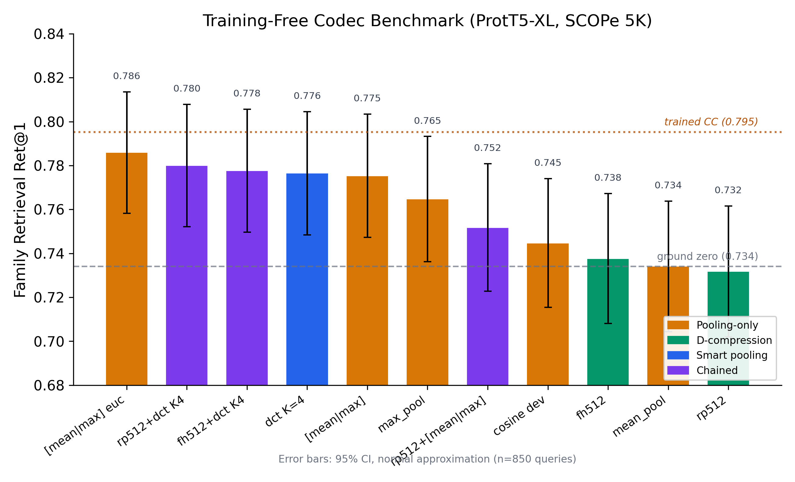

| Codec | Ret@1 | SS3 Q3 | Dim | Per-Residue? |
|-------|:-----:|:------:|:---:|:------------:|
| **V2 balanced (PQ M=128)** | **0.786** | **0.807** | 2048+512 | Yes (L, 512) |
| V1 rp512+dct K4 | 0.780 | 0.815 | 2048 | Yes (L, 512) fp16 |
| [mean\|max] euc | 0.786 | -- | 2048 | No |
| mean pool (ground zero) | 0.734 | 0.840 | 1024 | Yes (raw) |
| *Trained CC d256* | *0.795* | *0.834* | *256* | *Yes (256d)* |

ProtT5-XL on SCOPe 5K (n=850 queries). Error bars: 95% CI, normal approximation.

## The Fundamental Trade-off

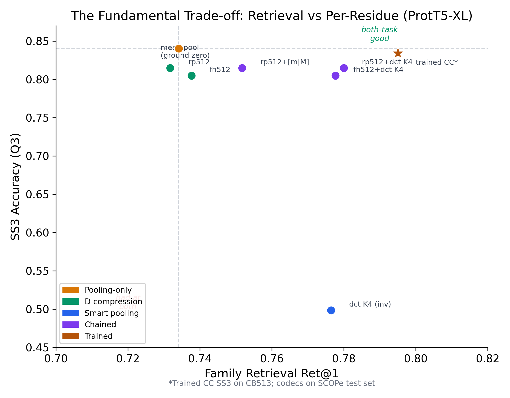

There is a fundamental tension between retrieval and per-residue quality:

- **L-compression** (collapsing the sequence dimension via pooling) boosts retrieval but destroys per-residue information
- **D-compression** (reducing embedding dimension via projection) preserves per-residue structure but barely helps retrieval

**Chained codecs solve this**: D-compress first (RP to 512d for per-residue), then smart-pool (DCT K=4 for retrieval). Both tasks are served from a single stored representation.

## Per-Residue Task Retention

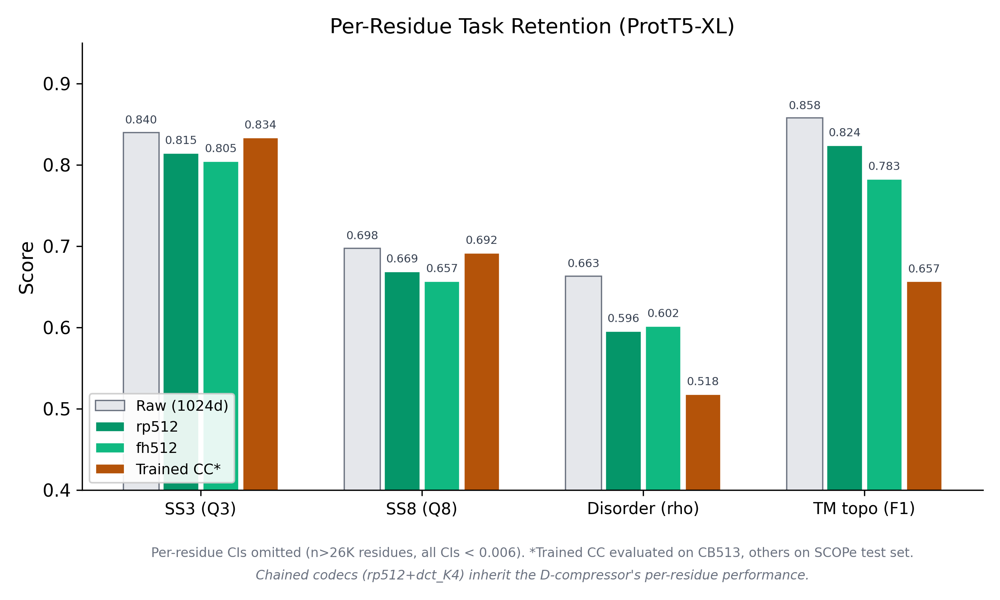

D-compression codecs (rp512, fh512) retain 93-97% of raw per-residue task performance across secondary structure, disorder, and membrane topology prediction. V2 `balanced` (red) shows the effect of PQ quantization on top: SS3 and SS8 remain close to the RP baseline, while disorder and TM see modest drops. The `full` (int4) tier matches the RP baseline almost exactly.

## Cross-PLM Results

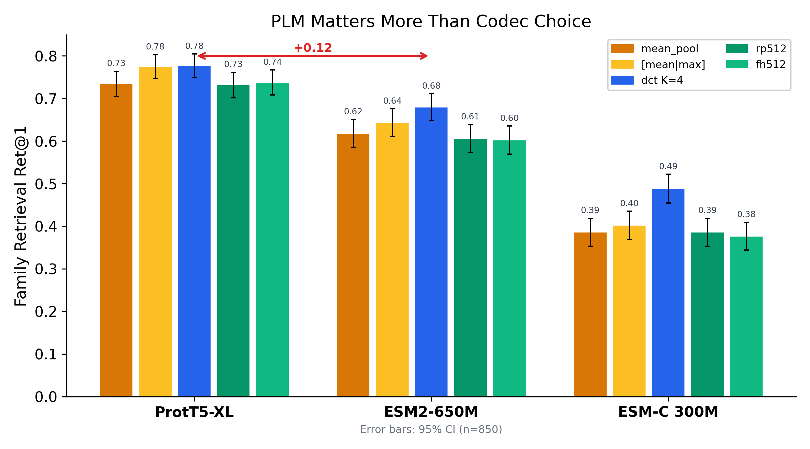

The choice of PLM matters far more than the choice of codec. ProtT5-XL outperforms ESM2-650M by ~0.12 Ret@1 across all codecs, and ESM2-650M outperforms ESM-C 300M by another ~0.23. The relative ranking of codecs is consistent across PLMs.

ABTT k=3 on ESM2 gives a massive +0.072 Ret@1 improvement (0.684 -> 0.755), because ESM2 has very concentrated PCs (intrinsic dimensionality = 41 vs ProtT5 = 374).

## Biology and Hierarchy Validation

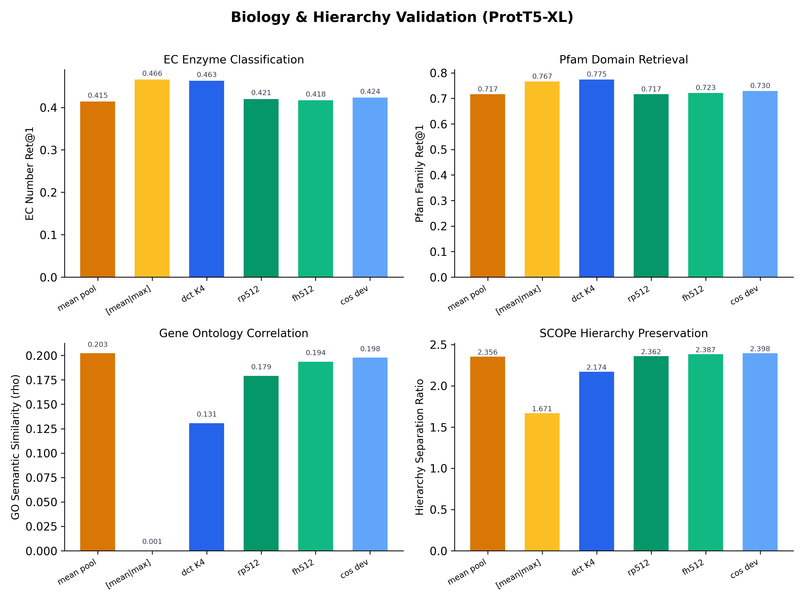

Codec performance validated on enzyme classification (EC numbers), Pfam domain retrieval, Gene Ontology semantic similarity, and SCOPe hierarchy separation.

## Evaluation Suite

Every codec is benchmarked against a comprehensive suite spanning retrieval, structure, biology, and per-residue probes. All evaluations use the same SCOPe 5K dataset (family-stratified train/test split, n=850 test queries) unless noted.

### Per-Protein Retrieval

| Metric | What it measures | Dataset |
|--------|-----------------|---------|
| Family Ret@1 | Nearest-neighbor same-family match (cosine) | SCOPe 5K |
| SF Ret@1 | Superfamily-level retrieval | SCOPe 5K |
| Fold Ret@1 | Fold-level retrieval | SCOPe 5K |
| MRR | Mean reciprocal rank | SCOPe 5K |

### Biological Annotation Correlation

| Metric | What it measures | Source |
|--------|-----------------|--------|
| GO Spearman rho | Embedding similarity vs Gene Ontology Jaccard | UniProt GO terms |
| EC Ret@1 (4 levels) | Enzyme classification retrieval | UniProt EC numbers |
| Pfam Ret@1 | Protein domain family retrieval | UniProt Pfam |

### Per-Residue Probes

| Task | Metric | Dataset |
|------|--------|---------|
| Secondary structure (3/8-class) | Q3 / Q8 accuracy | CB513 |
| Intrinsic disorder | Spearman rho | CheZOD |
| Transmembrane topology | Macro F1 | TMbed |

### Structural Validation

| Metric | What it measures | Source |
|--------|-----------------|--------|
| TM-score Spearman rho | Embedding similarity vs structural alignment | PDB via tmtools |
| lDDT | Local distance difference test | PDB structures |
| Contact precision | Top-L/5 contact prediction | PDB structures |

## Error Bars and Statistical Notes

**Retrieval Ret@1** is a proportion (n=850 queries). Error bars: SE = sqrt(p(1-p)/n), CI = p +/- 1.96*SE. At p=0.786: CI = +/-0.028.

**Per-residue probes** operate on >26K residues. CIs are negligible (<0.006).

**Training-free codecs are deterministic** -- no training randomness. RP/FH use fixed seed=42. Multi-seed RP variance (Exp 29): Ret@1 = 0.779 +/- 0.004 across 10 seeds.

## V1 Codec (Training-Free, No Codebook)

The V1 codec requires no codebook fitting -- fully deterministic with zero dependencies beyond the RP seed:

```python
from src.one_embedding.codec import OneEmbeddingCodec

codec = OneEmbeddingCodec(d_out=512, dct_k=4)
codec.encode_h5_to_h5("raw_embeddings.h5", "compressed.h5")

# Receiver needs only h5py + numpy -- no codec library, no codebook
data = OneEmbeddingCodec.load("compressed.h5")
data['per_residue']   # (L, 512) float16
data['protein_vec']   # (2048,) float16
```

V1 stores `(L, 512)` float16 per-residue embeddings + `(2048,)` protein vector. Size: ~179 KB/protein (4x compression). No quantization beyond float16. Pre-fitted ABTT weights available for ProtT5 and ESM2 via `Codec.for_plm('prot_t5')`.

Use V1 when you need: zero setup, no codebook distribution, simplest possible receiver.

## The Journey: 232 Methods in 37 Experiments

### Phase 1-4: Trained Compression (Experiments 1-10)

Explored attention pooling, MLP autoencoders, ChannelCompressor. Attention pool failed at scale (lost to PCA-128 on larger data). ChannelCompressor with contrastive fine-tuning achieved Ret@1=0.795 (d256, 3-seed mean). Requires labels and training -- not universal.

### Phase 5: Universal Codec Quest (Experiments 18-24)

Pivoted to training-free codecs. Tested DCT, Haar wavelets, spectral fingerprints, path signatures, curvature, gyration tensors, Fisher vectors, kernel mean embeddings. Key negative: path geometry adds noise, not signal. Key positive: DCT K=1 === mean pool; [mean|max] concat is a free +4pp retrieval boost.

### Phase 6: The Chained Codec Breakthrough (Experiments 25-26)

Discovered that chaining D-compression (RP512) + L-compression (DCT K=4) solves the fundamental tension. 14 codecs x 3 PLMs benchmarked. Best: rp512+dct_K4 -> Ret@1=0.780, SS3=0.815.

### Phase 7: Preprocessing + Quantization (Experiment 29)

ABTT3 (remove top-3 PCs) discovered as a free retrieval boost (+0.006 Ret@1). int4 quantization verified near-lossless for retrieval. 30+ techniques swept across 9 categories. The V1 One Embedding: ABTT3+RP512+int4+DCT K4 -> Ret@1=0.784, SS3=0.809, ~48 KB.

### Phase 8: Extreme Compression (Experiment 28)

45 methods on raw 1024d: wavelets, CUR, channel pruning, PQ, RVQ, tensor train, NMF, SimHash. All on raw space. Best: PQ M=64 at 0.701. Key insight missed: should have tested on preprocessed space.

### Phase 9: V2 -- The Preprocessed Space Changes Everything (Experiments 31-34)

Re-tested all compression on ABTT3+RP512 (decorrelated, isotropic). Results dramatically better:

- **Binary (1-bit) beats int4 for retrieval** (0.787 vs 0.784) -- RaBitQ effect
- **PQ M=128 matches V1 quality at 50% less storage** (26 vs 52 KB payload)
- **Pure VQ fails in 512d** -- even K=16384 caps at 0.621 Ret@1
- **RVQ fails in 512d** -- residual norms barely decrease between levels
- **OPQ doesn't help** -- RP already decorrelates

### Phase 10: Retention Validation (Experiments 36-37)

Comprehensive toolkit and structural retention benchmarks on V2 balanced. SS3 retention 101.7%, family Ret@1 99.7%, structural lDDT 100.7%, contact precision 106.5%. Disorder retention 90.9% with Ridge, 99.0% with CNN probes.

### Phase 11: Embedding Phylogenetics (Experiment 35)

Applied PLM embeddings to phylogenetic tree inference via Brownian Motion MCMC. Embedding trees achieve 10-11/12 monophyletic families vs 4-5/12 for sequence-based ML/Bayesian methods. Cross-validated against RevBayes.

## What Works, What Doesn't

### Works

- ABTT preprocessing (removes dominant protein-identity PCs)
- Random projection (JL-based dimensionality reduction, norm-preserving)
- Product Quantization on the preprocessed space (sub-vector codebooks)
- DCT K=4 for protein-level vectors (spectral pooling)
- Binary quantization for retrieval-only use cases
- CNN probes on compressed embeddings (SETH-style architecture)

### Doesn't Work

- Path geometry features (signatures, curvature, gyration) -- add noise
- Fisher vectors, Gram features -- poor for family retrieval
- Delta/DPCM encoding -- residues are i.i.d., deltas have MORE variance
- Whole-vector VQ in 512d -- codebook can't cover the space
- RVQ in 512d -- residuals don't decrease meaningfully
- OPQ/learned rotation after RP -- RP already decorrelates
- Two-head joint training -- hurts retrieval vs sequential approach
- Entropy coding on PQ codes -- 7.81/8.00 bits entropy, already near-optimal

## Addendum: Trained ChannelCompressor

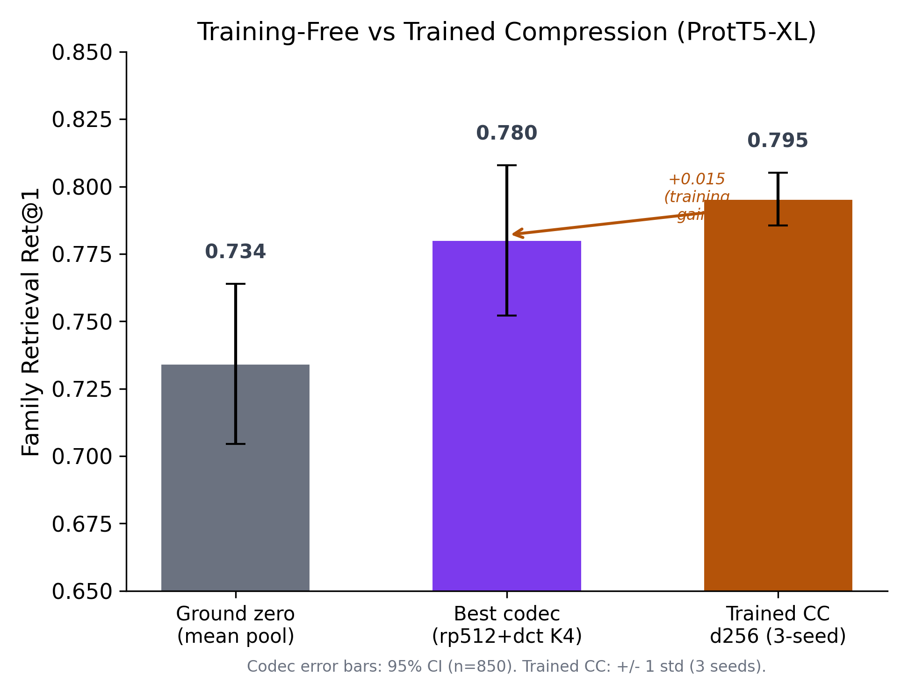

A pointwise MLP (1024 -> 512 -> 256) trained with unsupervised reconstruction then contrastive InfoNCE fine-tuning achieves Ret@1=0.795 +/- 0.012 (3-seed mean). Architecture: input (1024) -> LayerNorm -> Linear(512) -> GELU -> Residual -> Linear(256). Residual connections are critical (-0.169 without). Cross-dataset transfer validated on TS115, CheZOD, TMbed, ToxFam (F1=0.956, beats raw 1024d).

## Project Structure

```
src/
  one_embedding/           Research library
    core/                  Published codec (V1 Codec class, pre-fitted ABTT weights)
    codec_v2.py            V2 codec with PQ support (5 quality tiers)
    preprocessing.py       ABTT, PCA rotation
    quantization.py        int2/int4/int8/binary/PQ/RVQ
    transforms.py          DCT, Haar, spectral
    universal_transforms.py Random/feature-hashed projection
    extract/               ESM2 + ProtT5 embedding extraction
    tools/                 7 built-in tools (disorder, ss3, search, ...)
    io.py                  .oemb file format (H5-based, single + batch)
    cli.py                 Click CLI: extract, encode, inspect, disorder, search, align
    __init__.py            Top-level API: encode(), decode(), embed()

  compressors/             ChannelCompressor (trained), AttentionPool, MLP-AE
  extraction/              ESM2 + ProtT5 + ESM-C embedding extraction
  training/                Unified trainer with reconstruction + contrastive losses
  evaluation/              Retrieval, per-residue probes (SS3/disorder/TM),
                           biological annotations (GO/EC/Pfam), FAISS search index

experiments/
  01-04                    Setup, baselines, strategy comparison
  archive/05-10            Scale-up, collapse diagnosis, Track A/B (archived)
  11-17                    ChannelCompressor training + validation
  18-23                    Universal codec candidates + path geometry
  25-26                    Universal codec benchmark + chained codecs
  28-29                    Extreme compression + exhaustive sweep
  31-34                    V2 codec: bitwidth, PQ, VQ, progressive tiers
  35                       Embedding phylogenetics (MCMC + MrBayes)
  36-37                    Toolkit + structural retention benchmarks
  make_benchmark_barplots.py    Per-benchmark + V2 figures
  make_publication_figures.py   Publication figures

data/
  proteins/                FASTA files + metadata
  residue_embeddings/      H5 per-residue embeddings
  codebooks/               Pre-fitted PQ codebooks (per mode)
  benchmarks/              JSON result files from all experiments
  checkpoints/             Trained model weights
```

## Requirements

- Python 3.12, [uv](https://docs.astral.sh/uv/) package manager
- PyTorch >= 2.0 with MPS (Apple Silicon) or CUDA
- ~10 GB disk for embeddings and checkpoints

```bash
uv sync  # Installs all dependencies from pyproject.toml
```

## License

MIT. See [LICENSE](LICENSE).
