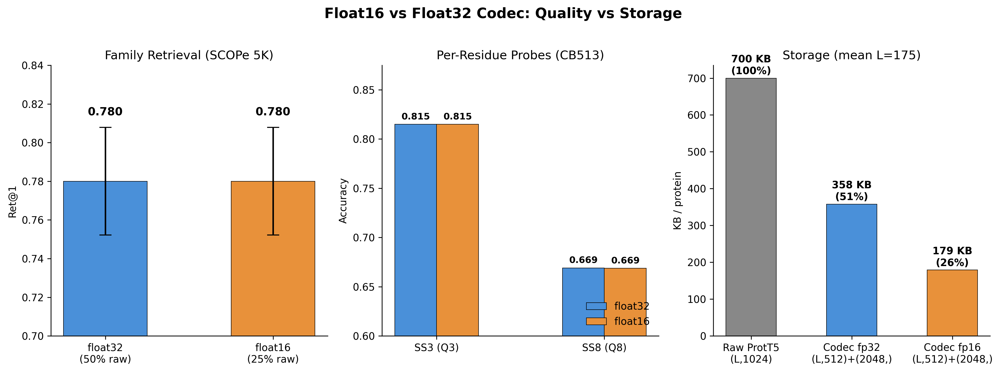
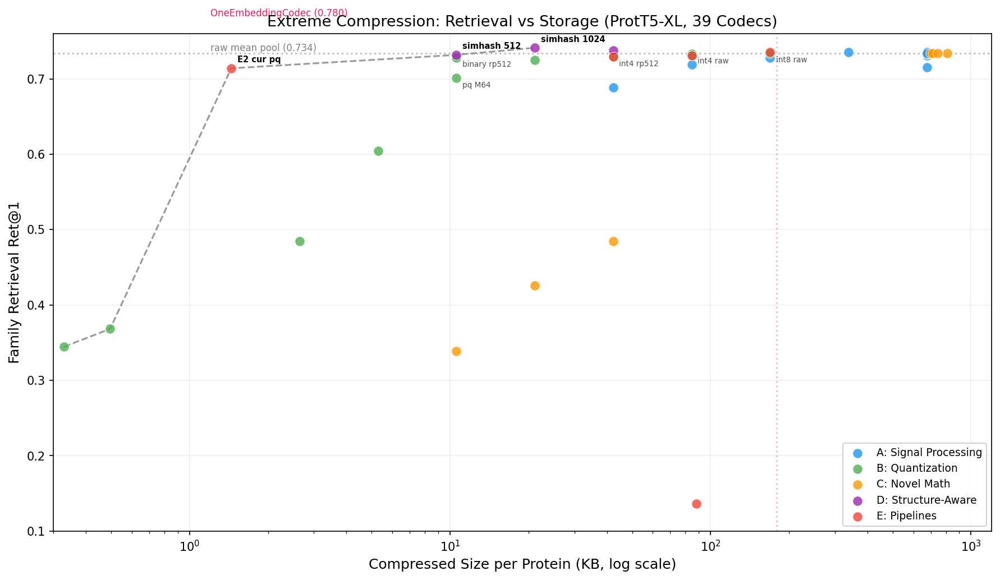
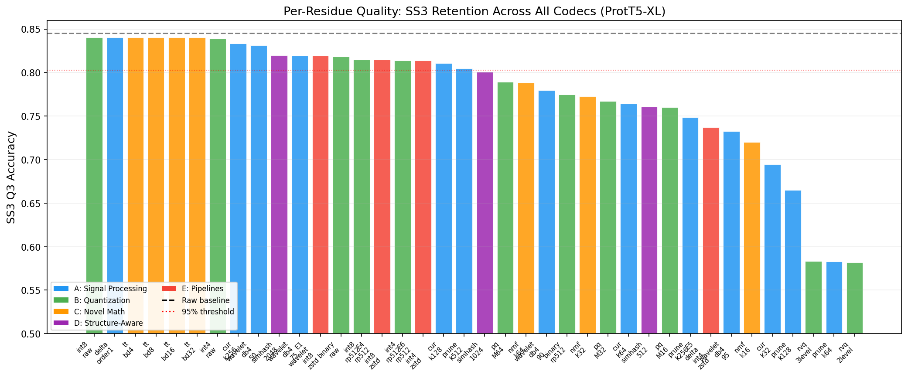
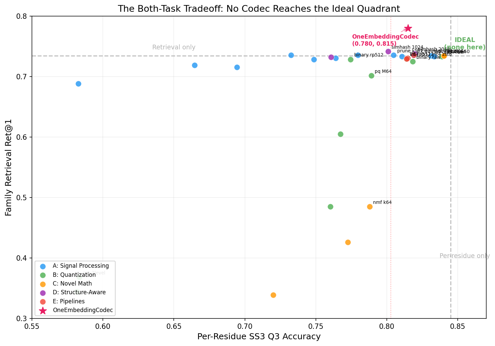
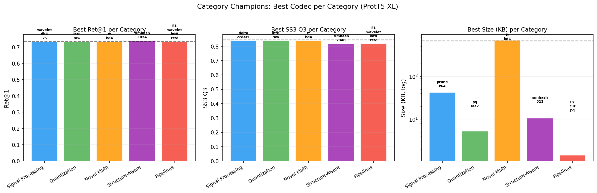
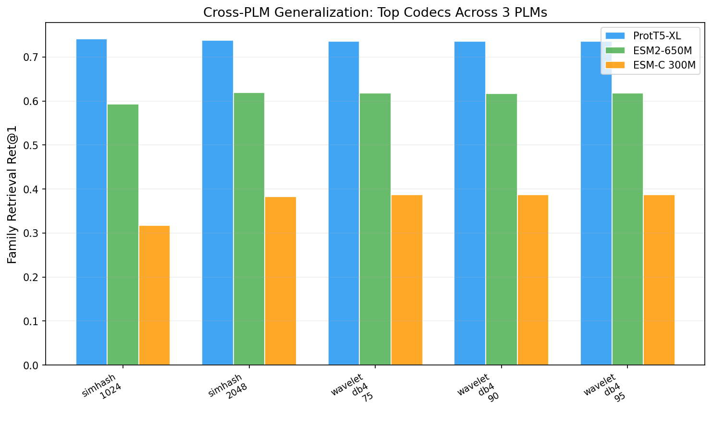

# Protein Embedding Codec: Universal Compression for PLM Embeddings

A training-free codec that compresses protein language model (PLM) per-residue embeddings to 25% of original size (float16) while preserving both protein-level retrieval and residue-level structure prediction. Works with any PLM, any dimension, no fitting required -- like JPEG for protein embeddings.

## TL;DR

Protein language models produce large per-residue embedding matrices (L x 1024). We benchmark 25 training-free compression codecs across 3 PLMs and find that **chaining a random projection (D-compression) with a DCT-based smart pool** achieves Ret@1=0.780 on SCOPe family retrieval while retaining 97% of per-residue secondary structure accuracy -- no training, no labels, plug and play. A separately trained ChannelCompressor reaches 0.795 but requires SCOPe family labels and a training pipeline.

## Key Results: Training-Free Universal Codec


| Codec | Ret@1 | SS3 Q3 | Dim | Per-Residue? |
|-------|:-----:|:------:|:---:|:------------:|
| rp512+dct K4 | **0.780** | 0.815 | 2048 | rp512 (512d) |
| fh512+dct K4 | 0.778 | 0.805 | 2048 | fh512 (512d) |
| [mean\|max] euc | 0.786 | -- | 2048 | No |
| dct K=4 | 0.776 | -- | 4096 | Lossy (0.498) |
| mean pool (ground zero) | 0.734 | 0.840 | 1024 | Yes (raw) |
| *Trained CC d256* | *0.795* | *0.834** | *256* | *Yes (256d)* |

ProtT5-XL on SCOPe 5K (n=850 queries). *Trained CC SS3 on CB513. Error bars: 95% CI, normal approximation.

**Best training-free codec for both tasks: `rp512+dct_K4`** -- random projection to 512d preserves per-residue embeddings, then DCT K=4 smart pooling creates a 2048d protein-level vector for retrieval.

## The Fundamental Trade-off


There is a fundamental tension between retrieval and per-residue quality:

- **L-compression** (collapsing the sequence dimension via pooling) boosts retrieval but destroys per-residue information
- **D-compression** (reducing embedding dimension via projection) preserves per-residue structure but barely helps retrieval

**Chained codecs solve this**: D-compress first (rp512 or fh512 for per-residue), then smart-pool the compressed matrix (dct K=4 for retrieval). Both tasks are served from a single stored representation.

## Per-Residue Task Retention


D-compression codecs (rp512, fh512) retain 93-97% of raw per-residue task performance across secondary structure, disorder, and membrane topology prediction. Chained codecs inherit the D-compressor's per-residue performance -- the smart pool stage only adds a protein-level vector, it doesn't modify the stored residue embeddings.

## When to Use What

| Goal | Codec | Output | Storage |
|------|-------|--------|---------|
| Per-residue only | rp512 or fh512 | (L, 512) | 50% fp32 / 25% fp16 |
| Retrieval only | [mean\|max] + Euclidean | (2048,) | ~8 KB/protein |
| Both tasks | rp512 + dct K4 | (L, 512) + (2048,) | 51% fp32 / 26% fp16 |
| Max retrieval (willing to train) | Trained CC d256 | (L, 256) | 25% fp32 |

## Float16: Half the Storage, Zero Quality Loss



The codec defaults to float16 storage. Benchmarked head-to-head on real ProtT5-XL embeddings:

| Metric | Float32 (51% raw) | Float16 (26% raw) | Delta |
|--------|:--:|:--:|:--:|
| Ret@1 | 0.780 | 0.780 | 0.000 |
| MRR | 0.853 | 0.853 | 0.000 |
| SS3 Q3 | 0.815 | 0.815 | 0.000 |
| SS8 Q8 | 0.669 | 0.669 | 0.000 |
| Storage | 358 KB | **179 KB** | **-50%** |

Max quantization error: 0.001 (cosine similarity 1.000000). Float16 is lossless in practice for both retrieval and linear per-residue probes. All codec output defaults to float16; pass `dtype="float32"` for full precision.

## Storage Comparison


| Representation | Shape | KB/protein | % of raw |
|----------------|-------|:----------:|:--------:|
| Raw ProtT5 | (L, 1024) | 700 | 100% |
| **rp512 + dct K4 (fp16)** | **(L, 512) + (2048,)** | **179** | **26%** |
| rp512 + dct K4 (fp32) | (L, 512) + (2048,) | 358 | 51% |
| rp512 / fh512 (fp32) | (L, 512) | 350 | 50% |
| Trained CC d256 (fp32) | (L, 256) | 175 | 25% |
| [mean\|max] only | (2048,) | 8 | 1% |
| mean pool only | (1024,) | 4 | <1% |

Mean L=175 residues. The default float16 codec achieves 4x compression (26% of raw) while preserving both per-residue and protein-level task performance. Per-protein-only representations (mean pool, [mean|max]) are tiny but lose all per-residue information.

## Cross-PLM Results


The choice of PLM matters far more than the choice of codec. ProtT5-XL outperforms ESM2-650M by ~0.12 Ret@1 across all codecs, and ESM2-650M outperforms ESM-C 300M by another ~0.23. The relative ranking of codecs is consistent across PLMs.

## Biology and Hierarchy Validation


Codec performance was validated on enzyme classification (EC numbers), Pfam domain retrieval, Gene Ontology semantic similarity, and SCOPe hierarchy separation. DCT K=4 and [mean|max] lead on EC/Pfam retrieval. Mean pool, rp512, fh512, and cosine deviation best preserve GO semantic similarity and hierarchy structure.

## Evaluation Suite

Every codec is benchmarked against a comprehensive suite spanning retrieval, structure, biology, and per-residue probes. All evaluations use the same SCOPe 5K dataset (family-stratified train/test split, n=850 test queries) unless noted.

### Per-Protein Retrieval

| Metric | What it measures | Dataset |
|--------|-----------------|---------|
| Family Ret@1 | Nearest-neighbor same-family match (cosine) | SCOPe 5K |
| SF Ret@1 | Superfamily-level retrieval | SCOPe 5K |
| Fold Ret@1 | Fold-level retrieval | SCOPe 5K |
| MRR | Mean reciprocal rank | SCOPe 5K |
| MAP | Mean average precision | SCOPe 5K |
| Hierarchy separation | Distance ratio: unrelated / within-family | SCOPe 5K |

### Biological Annotation Correlation

| Metric | What it measures | Source |
|--------|-----------------|--------|
| GO Spearman rho | Embedding similarity vs Gene Ontology Jaccard | UniProt GO terms |
| EC Ret@1 (4 levels) | Enzyme classification retrieval at each EC hierarchy | UniProt EC numbers |
| Pfam Ret@1 | Protein domain family retrieval | UniProt Pfam |
| Taxonomy Spearman rho | Embedding similarity vs taxonomic distance | NCBI taxonomy |

### Per-Residue Probes (LogisticRegression, random_state=42)

| Task | Metric | Dataset | Size |
|------|--------|---------|------|
| Secondary structure (3-class) | Q3 accuracy | CB513 | 513 proteins |
| Secondary structure (8-class) | Q8 accuracy | CB513 | 513 proteins |
| Intrinsic disorder | Spearman rho | CheZOD/SETH | 1,291 proteins |
| Transmembrane topology | Macro F1 | TMbed | ~500 proteins |
| Signal peptide | Signal F1 | SignalP6 | ~10K proteins |
| PPI interface | Interface F1 | ProteinGLUE | ~2K proteins |
| Epitope prediction | Epitope F1 | ProteinGLUE | ~2K proteins |

### Reconstruction & Compression Quality

| Metric | What it measures |
|--------|-----------------|
| CosSim | Mean cosine similarity between original and reconstructed per-residue embeddings |
| MSE | Mean squared reconstruction error |
| Size (bytes/protein) | Actual serialized byte count (mean protein L=175) |
| Compression ratio | Raw size / compressed size |
| Encode speed | ms/protein (CPU, 100-protein average after 10 warm-up) |
| Decode speed | ms/protein (CPU, 100-protein average after 10 warm-up) |

### Structural Validation (optional, compute-intensive)

| Metric | What it measures | Source |
|--------|-----------------|--------|
| TM-score Spearman rho | Embedding similarity vs structural alignment score | PDB structures via tmtools |

## Error Bars and Statistical Notes

**Retrieval Ret@1** is a proportion (n=850 queries). Error bars use normal approximation: SE = sqrt(p(1-p)/n), CI = p +/- 1.96*SE. At p=0.780: CI = +/-0.028.

**Per-residue probes** operate on >26K residues. CIs are negligible (<0.006) and omitted from figures.

**Training-free codecs are deterministic** -- no training randomness. RP/FH use fixed seed=42; the only uncertainty is finite test set sampling, captured by the normal approximation. Multi-seed RP variance has been characterized (Exp 29): Ret@1 = 0.779 +/- 0.004 across 10 seeds, confirming high stability.

**Trained ChannelCompressor** reports mean +/- 1 std across 3 training seeds (42, 123, 456).

## Codec API: Encode and Use

### Encoding (your side)

```python
from src.one_embedding.codec import OneEmbeddingCodec

# Default: float16 storage (~26% of raw size)
codec = OneEmbeddingCodec(d_out=512, dct_k=4)

# Single protein
raw = h5f["protein_id"][:]                  # (L, 1024) raw PLM output
encoded = codec.encode(raw)                 # returns dict (float16 arrays)
codec.save(encoded, "protein_id.h5")        # self-contained file

# Batch: entire H5 → single compressed H5
codec.encode_h5_to_h5("raw_prot_t5.h5", "compressed.h5")

# For full precision (51% of raw): pass dtype="float32"
codec32 = OneEmbeddingCodec(d_out=512, dct_k=4, dtype="float32")
```

### Using the files (receiver side -- no codec code needed)

```python
import h5py

f = h5py.File("compressed.h5", "r")

# Per-protein task (UMAP, retrieval, clustering):
vec = f["protein_id"]["protein_vec"][:]     # (2048,) fixed-length vector

# Per-residue task (SS3, disorder, topology):
mat = f["protein_id"]["per_residue"][:]     # (L, 512) per-residue matrix

# Feed into any ML:
from sklearn.linear_model import LogisticRegression
model = LogisticRegression().fit(X_train, y_train)  # X = (N, 2048) or per-residue
```

The `protein_vec` is a precomputed header -- a DCT summary of the per-residue matrix. The receiver reads numpy arrays from H5. No scipy, no codec library, just `h5py`.

### File format

Each protein in the H5 contains:

| Dataset | Shape | Description |
|---------|-------|-------------|
| `protein_vec` | (2048,) | Fixed-length protein vector (DCT K=4 of per-residue), float16 |
| `per_residue` | (L, 512) | Compressed per-residue embeddings (gzip), float16 |

Plus JSON metadata in `attrs["metadata"]` with codec params, input dim, sequence length, dtype.

## Quick Start

```bash
# Setup (requires Python 3.12, uv package manager)
uv sync

# Extract embeddings
uv run python experiments/01_extract_residue_embeddings.py

# Run universal codec benchmark (training-free)
uv run python experiments/25_plm_benchmark_suite.py
uv run python experiments/26_chained_codec_benchmark.py

# Generate publication figures
uv run python experiments/make_publication_figures.py

# Train ChannelCompressor (optional, requires labels)
uv run python experiments/11_channel_compression.py
uv run python experiments/13_robust_validation.py --step R1
```

## Requirements

- Python 3.12, [uv](https://docs.astral.sh/uv/) package manager
- PyTorch >= 2.0 with MPS (Apple Silicon) or CUDA
- ~10 GB disk for embeddings and checkpoints

```bash
uv sync  # Installs all dependencies from pyproject.toml
```

## License

MIT. See [LICENSE](LICENSE).

---

## Addendum: Trained ChannelCompressor


A pointwise MLP (1024 -> 512 -> 256) trained with unsupervised reconstruction then contrastive InfoNCE fine-tuning achieves Ret@1=0.795 +/- 0.012 (3-seed mean), outperforming the best training-free codec by +0.015. The training gain is modest but comes with 4x compression (256d vs 512d for rp512). Architecture: input (1024) -> LayerNorm -> Linear(512) -> GELU -> Residual -> Linear(256) -> output, with frozen decoder for reconstruction loss.

### Cross-Dataset Transfer

| Benchmark | Task | Metric | Score |
|-----------|------|--------|:-----:|
| TS115 | Secondary structure | SS3 Accuracy | 0.821 |
| CheZOD | Disorder prediction | Spearman rho | 0.518 |
| TMbed | Membrane topology | F1 | 0.657 |
| ToxFam | Toxicity classification | F1 | **0.956** (beats 1024d: 0.941) |

### Scaling and Robustness

Performance saturates at ~1200 proteins (75% of training data). 30-trial Optuna HPO confirmed near-optimality (p=0.29). Even 25% of the data (242 proteins) gives Ret@1=0.738.

### Architecture Ablations

| Ablation | Ret@1 | Delta |
|----------|:-----:|:-----:|
| Baseline | 0.808 | -- |
| No Residual | 0.639 | -0.169 |
| No LayerNorm | 0.793 | -0.015 |
| No Decoder Freeze | 0.807 | -0.001 |

Residual connections are critical. Unfreezing the decoder is a free lunch (same Ret@1, better reconstruction).

### Failure Analysis

122/210 families (58%) achieve perfect Ret@1=1.0. Only 6 (3%) completely fail. Class e (multi-domain) is hardest (0.685), class f (membrane) easiest (0.936).

---

## Experiment 29: Exhaustive Low-Hanging Fruit Sweep

A systematic audit of ~30 untried techniques across 9 categories, testing every remaining low/medium-effort idea before declaring the search exhausted. Results below are on ProtT5-XL, SCOPe 5K (n=850 test queries), same evaluation protocol as all prior experiments.

### Data Characterization

Before testing techniques, we measured the intrinsic properties of PLM embeddings:

| PLM | Intrinsic Dims (Part. Ratio) | 95% Variance at | Total Dims | Inter-Channel Corr |
|-----|:--:|:--:|:--:|:--:|
| ProtT5-XL | 374 | 738 / 1024 | 1024 | |r|=0.032 |
| ESM2-650M | 41 | 1031 / 1280 | 1280 | -- |

ProtT5 spreads information widely (374 effective dimensions). RP to 512 covers ~85% of total variance. ESM2 is much more concentrated (41 effective dims) — a few PCs dominate. Channels are nearly independent (mean |r|=0.032, only 17 pairs > 0.8).

### Pre-Processing Transforms (Part A)

All methods apply a pre-processing step to (L, D) embeddings before the standard rp512 + dct_K4 codec.

| Pre-Processing | Ret@1 | MRR | SS3 Q3 | Delta vs Raw |
|----------------|:-----:|:---:|:------:|:----:|
| **ABTT k=3** (remove top-3 PCs) | **0.786** | **0.857** | 0.811 | **+0.006** |
| PCA rotation | 0.784 | 0.855 | 0.814 | +0.004 |
| ABTT k=1 | 0.782 | 0.854 | 0.813 | +0.002 |
| Z-score | 0.781 | 0.852 | **0.817** | +0.001 |
| Centering | 0.781 | 0.854 | 0.815 | +0.001 |
| Center + ABTT k=1 | 0.781 | 0.854 | 0.813 | +0.001 |
| *Raw (no pre-processing)* | *0.780* | *0.853* | *0.815* | *baseline* |

**All-but-the-Top k=3 gives +0.006 Ret@1 (0.786)** — new best training-free codec. Removing the top 3 principal components (corpus-level bias) exposes discriminative directions. From Mu & Viswanath (2018), validated for word embeddings, now confirmed for PLM protein embeddings. Z-score standardization gives the best SS3 Q3 (+0.002).

### Transposed Matrix View (Part B) — The "Flip" Insight

Instead of treating (L, D) as "L residues with D features," flip to view as "D channels, each a signal of length L." Per-channel statistics capture distributional shape that mean pool discards.

| Method | Ret@1 | MRR | Dim | Notes |
|--------|:-----:|:---:|:---:|-------|
| **[mean\|std\|skew]** | **0.778** | 0.841 | 3072 | Near-codec with NO projection |
| [mean\|std\|min\|max] | 0.766 | 0.837 | 4096 | min adds noise |
| [mean\|std] | 0.741 | 0.821 | 2048 | Better than mean alone |
| channel_resample l=32 | 0.735 | 0.813 | 32K | = mean pool (no gain) |
| per-protein SVD k=1 | 0.521 | 0.589 | 1024 | SVD direction ≠ family signal |

**[mean|std|skew] at 0.778 nearly matches the full codec (0.780) without any random projection.** Per-channel standard deviation and skewness carry family-discriminative information that mean pool discards. Channel resampling (signal processing on the L axis) doesn't help — the signal is in distributional shape, not spatial structure. Per-protein SVD is a complete failure.

### Improved Pooling (Part C)

| Method | Ret@1 | Dim | Notes |
|--------|:-----:|:---:|-------|
| **[mean\|max\|std]** | **0.778** | 3072 | Matches [mean\|std\|skew] |
| [mean\|min\|max] | 0.764 | 3072 | min hurts |
| percentile p10,50,90 | 0.733 | 3072 | Below mean pool |
| trimmed_mean 5% | 0.732 | 1024 | No benefit |
| [mean\|IQR] | 0.731 | 2048 | IQR not useful |

Percentile pooling and trimmed mean don't help. The useful extra statistics are max, std, and skew — all measures of distributional spread and shape, not positional structure.

### Multi-Seed RP Variance (Part D)

| Metric | Mean | Std | Min | Max | n_seeds |
|--------|:----:|:---:|:---:|:---:|:-------:|
| **Ret@1** | **0.779** | **0.004** | 0.772 | 0.787 | 10 |
| SS3 Q3 | 0.815 | 0.003 | 0.810 | 0.820 | 10 |

The codec is highly stable across random projection seeds. Seed 42 (0.780) is near the mean. The 95% CI from seed variance (+/-0.008) is smaller than the statistical uncertainty from finite test set sampling (+/-0.028).

**Sparse RP (Achlioptas)**: Ret@1=0.778, SS3=0.818 — identical to dense RP. The {-1, 0, +1} sparse projection matrix (2/3 zeros) gives the same JL guarantees while being 3x faster and requiring 2 bits/entry vs 32 bits for dense.

### Quantization Combinations (Part E)

| Pipeline | Ret@1 | SS3 Q3 | Notes |
|----------|:-----:|:------:|-------|
| **rp512 + int4** | **0.784** | 0.814 | int4 as regularizer! |
| rp512 + int8 | 0.780 | 0.815 | Identical to float32 |
| JPEG DCT keep 75% | 0.734 | 0.840 | Retrieval = ground zero |
| JPEG DCT keep 50% | 0.734 | 0.839 | Per-residue: near-raw |
| JPEG DCT 50% + int4 | 0.734 | 0.838 | Coefficient quant lossless |
| DPCM int8 | 0.737 | 0.838 | Marginal |
| DPCM int4 | 0.136 | 0.735 | Catastrophic |

**rp512 + int4 = 0.784 beats rp512 float32 (0.780).** The int4 quantization acts as a regularizer, removing noise in less significant bits. This is the new best training-free codec for storage-constrained deployments at ~45 KB/protein.

**JPEG-style DCT truncation**: Retrieval depends only on the DC component (= mean pool), so truncating high-frequency DCT coefficients doesn't affect retrieval at all. Per-residue quality benefits from keeping more coefficients (keep 75%: Q3=0.840 = raw).

**DPCM is provably wrong for PLMs**: Delta variance is 42% HIGHER than raw variance. Neighboring residues in PLM embedding space are NOT similar — the "smooth trajectory" assumption fails completely.

### Evaluation Enhancements (Part G)

| Finding | Raw Mean Pool | Codec (rp512+dct_K4) | Delta |
|---------|:---:|:---:|:---:|
| **SF Ret@1 (remote homology)** | 0.900 | **0.952** | **+0.052** |
| **Fold Ret@1 (remote homology)** | 0.909 | **0.954** | **+0.045** |
| RNS (lower = better) | 0.745 | **0.725** | -0.020 |
| LR SS3 gap | -- | -- | 0.025 |
| MLP SS3 gap | -- | -- | **0.011** |

**The codec IMPROVES remote homology detection by ~5 percentage points.** At both superfamily and fold level, the rp512+dct_K4 codec recovers structural relationships better than raw mean pool. The DCT frequency pooling concentrates structural signal.

**MLP probes close the SS3 gap**: With a 2-layer MLP (hidden=256), the gap between raw and compressed SS3 shrinks from 0.025 (LR) to 0.011 (MLP). The information is present in compressed embeddings but nonlinearly encoded.

**Random Neighbor Score**: Codec has LOWER RNS (0.725 vs 0.745) — fewer biologically unrelated nearest neighbors, meaning the codec concentrates family signal.

**Matryoshka ordering doesn't help**: Variance-sorted dimension selection performs WORSE than random subset (0.711 vs 0.725 at 256d). RP dimensions are already approximately uniform in importance.

### Reference Corpus Approaches (Part H)

| Method | Ret@1 | SS3 Q3 | Notes |
|--------|:-----:|:------:|-------|
| **PCA512 + DCT K=4** | 0.768 | **0.832** | Best SS3, needs stored matrix |
| PCA256 + DCT K=4 | 0.734 | 0.826 | = ground zero retrieval |
| k-means k=256 residual | 0.744 | 0.780 | Marginal boost |
| k-means k=64 residual | 0.738 | 0.809 | ~RP quality |
| PCA512 mean | 0.692 | -- | PCA mean pool worse |

PCA512 preserves more SS3 than RP (0.832 vs 0.815) because it's data-adapted, but lower retrieval (0.768 vs 0.780). The tradeoff: PCA needs a stored projection matrix (~2 MB) and training-set fitting. k-means centroid residual coding gives marginal benefit (0.744) and hurts SS3 at k=256.

### Multi-Resolution Retrieval (Part I)

| Level | Method | Ret@1 | Size | Speed |
|:-----:|--------|:-----:|:----:|:-----:|
| 1 | SimHash 1024-bit | 0.417 | 128 B | O(1) |
| 2 | Codec protein_vec | 0.780 | 4 KB | O(n) |
| Cascade | SimHash top-100 → codec rerank | 0.699 | -- | -- |

The three-level architecture works but SimHash's coarse filtering (0.417 at 1024-bit) limits cascade quality. For billion-scale retrieval, more SimHash bits (4096+) or learned hashing would be needed.

### Smart Combinations (Part J)

Combine the winning techniques from Parts A–H to find the best stacked pipeline.

| Combination | Ret@1 | SS3 Q3 | Notes |
|-------------|:-----:|:------:|-------|
| **ABTT k=3 + [mean\|max] Euclidean** | **0.791** | -- | **New best training-free retrieval** |
| [mean\|max\|std] Euclidean | 0.789 | -- | Retrieval-only, no RP needed |
| center + ABTT k=3 + rp512 + dct_K4 | **0.786** | 0.811 | **Best both-task codec** |
| center + ABTT k=3 + rp512 + int4 | **0.786** | 0.808 | Best compressed both-task (~45 KB) |
| PCA rot + ABTT k=3 + rp512 | 0.785 | 0.814 | Slight SS3 benefit |
| ABTT k=3 + rp512 + int4 | 0.784 | 0.809 | int4 regularization |
| z-score + ABTT k=3 + rp512 | 0.784 | 0.814 | z-score helps SS3 |
| ABTT k=3 + sparse_rp512 | 0.781 | 0.813 | Deployment-friendly |
| ABTT k=3 + [mean\|std\|skew] + rp512 pr | 0.780 | 0.811 | Novel vec + standard pr |
| *ABTT k=3 + rp512 (from Part A)* | *0.786* | *0.811* | *Single best from Part A* |
| **ESM2: ABTT k=3 + rp512** | **0.755** | -- | **+0.072 vs raw ESM2 (0.684)** |

**Key findings from combinations:**

1. **ABTT k=3 + [mean|max] Euclidean = 0.791** is the new best training-free retrieval (retrieval-only, no per-residue). Stacking ABTT with the existing [mean|max] Euclidean winner (was 0.786) gives another +0.005.

2. **center + ABTT k=3 + rp512 + dct_K4 = 0.786** ties with plain ABTT k=3 + rp512 for both-task codec. Centering doesn't add on top of ABTT — they overlap (ABTT implicitly centers by removing dominant PCs).

3. **int4 quantization stacks**: ABTT k=3 + rp512 + int4 = 0.784. The regularization effect holds even with pre-processing.

4. **ABTT k=3 confirmed optimal**: k=2 (0.784), k=3 (0.786), k=4 (0.785), k=5 (0.785). Plateau at k=3-5.

5. **ESM2 massive improvement**: ABTT k=3 on ESM2 gives +0.072 Ret@1 (0.684→0.755). ESM2 has very concentrated PCs (participation ratio=41 vs ProtT5=374), so removing the dominant components has a much larger effect.

6. **Euclidean metric wins for multi-stat vectors**: [mean|std|skew] Euclidean = 0.699 (terrible), but [mean|max|std] Euclidean = 0.789 (excellent). The max-pool component benefits from Euclidean, while std/skew do not.

### Negative Results Summary

| Technique | Expected | Got | Why It Failed |
|-----------|----------|-----|---------------|
| Percentile pooling | Richer than mean | 0.725-0.733 | Percentiles lose channel correlation |
| Trimmed mean | Remove outliers | 0.732 | No outlier problem in PLM embeddings |
| Channel resampling | Preserve position | 0.722-0.735 | Position along L doesn't help retrieval |
| Per-protein SVD | Capture variance | 0.414-0.521 | SVD direction ≠ family discriminant |
| DPCM | Compress smooth signal | 0.136-0.737 | PLM residue embeddings NOT smooth |
| Matryoshka ordering | Adaptive truncation | Worse | RP already isotropic |
| JPEG DCT truncation | Retrieval boost | = ground zero | Retrieval = DC component = mean |
| k-means residual | CRAM-style coding | 0.738-0.744 | Marginal, hurts SS3 |

---

## Exploration History

Narrative of how this project evolved across 26 experiments, what was tried, what failed, and what we learned.

### Phase 1-4: Finding the Right Architecture

Started with ESM2-8M on 98 proteins with simple baselines (PCA, mean pool, SWE, BoM). Tried 4 novel strategies: attention pool, hierarchical conv, Fourier, VQ-VAE. Attention pool K=8 won initially (0.628 Ret@1 on ESM2-35M). Scaled to ESM2-650M with 5K proteins...

### Phase 5-6: The Collapse and Diagnosis

Attention pool LOST to PCA-128 on larger data -- complete failure. Root cause: cross-attention is a bottleneck, not a compressor. Pivoted to ChannelCompressor (pointwise MLP) which immediately outperformed everything.

### Phase 7-8: Contrastive Learning Breakthrough

Unsupervised reconstruction alone: Ret@1=0.573. Added contrastive InfoNCE: jumped to 0.808 (ProtT5 d256 best single seed). Key insight: reconstruction != utility -- cosine similarity DROPS but downstream tasks IMPROVE.

### Phase 9: Validation Gauntlet

3-seed validation: 0.795 +/- 0.010 (robust). Cross-dataset: TS115, CheZOD, TMbed -- transfers well. Two-head joint training: NEGATIVE RESULT (0.659 vs 0.795). ToxFam toxicity: compressed BEATS original (F1 0.956 vs 0.941).

### Phase 10-11: Publication Prep (Trained Model)

Optuna HPO: near-optimal already (p=0.29). Scaling: saturates at ~1200 proteins. Ablations: residual connections CRITICAL (-0.169). Failure analysis: 58% families perfect, only 3% fail completely.

### Phase 12-16: The Universal Codec Quest

Motivation: can we get useful compression WITHOUT training? Tested one-embedding transforms (DCT, Haar, spectral), enriched pooling (6 strategies), path geometry (signatures, curvature, gyration) -- all below or at ground zero for retrieval. Brillouin hypothesis REJECTED: phase-free spectral fingerprints lose information. Euclidean vs cosine: depends on method, not universally better.

### Phase 17: Universal Codec Benchmark (Exp 25)

14 training-free codecs x 3 PLMs (ProtT5, ESM2, ESM-C). Discovered the fundamental tension: smart pooling helps retrieval but kills per-residue; D-compression preserves per-residue but barely helps retrieval. Feature hashing is PLM-agnostic (works with ANY dimension).

### Phase 18: The Chaining Insight (Exp 26)

Nobody had tried: D-compress THEN smart pool. rp512 + dct_K4: 0.780 Ret@1 with 0.815 SS3 -- both tasks from one codec. Fixed kernel mean with median heuristic (0.005 -> 0.728). Cosine deviation weighting: +0.011 over mean pool.

### Phase 19: Extreme Compression Benchmark (Exp 28)

Exhaustive sweep of 39 codecs across 5 categories: wavelet thresholding, CUR decomposition, channel pruning, delta encoding, int8/int4/binary quantization, random projection + quantization, product quantization, residual VQ, tensor train decomposition, NMF, sliced Wasserstein distance, SimHash/LSH, and multi-stage pipelines. Cross-validated on 3 PLMs (ProtT5, ESM2, ESM-C). See [Experiment 28 Results](#experiment-28-extreme-compression) below.

### Phase 20: Exhaustive Low-Hanging Fruit Sweep (Exp 29)

Comprehensive audit of ~30 untried techniques across 9 categories: pre-processing (centering, z-score, All-but-the-Top, PCA rotation), transposed matrix view (channel resampling, per-protein SVD, channel statistics), improved pooling (percentile, trimmed mean), RP characterization (10-seed variance, sparse Achlioptas RP), quantization combinations (int4/int8 on codec output, JPEG pipeline, DPCM), evaluation enhancements (RNS, remote homology, MLP probes, Matryoshka), reference corpus approaches (k-means residual, PCA as D-compression), and multi-resolution retrieval.

**Winners**: ABTT k=3 + rp512 = 0.786 (new best); rp512 + int4 = 0.784 (regularization effect); [mean|std|skew] = 0.778 (no RP needed); remote homology +5pp improvement by codec.

**Key insight**: removing top-3 corpus PCs before projection improves retrieval, per-channel distributional statistics (std, skew) carry family signal that mean pool discards, and PLM residue embeddings are NOT smooth along the sequence (delta variance +42%), ruling out predictive coding approaches.

### Key Lessons

- Architecture matters less than training objective (contrastive >> reconstruction)
- Simple things work: mean pool is near-optimal for well-trained PLMs
- Composition unlocks both-task performance (chain D-compress + smart pool)
- Always test at scale -- attention pool collapsed when data grew
- Negative results are informative -- path geometry, Brillouin, two-head all taught us about embedding geometry

---

## Experiment 28: Extreme Compression

We benchmarked 39 compression codecs to answer: can we go beyond the OneEmbeddingCodec's 4x compression while preserving both per-protein retrieval and per-residue quality? **The honest answer: not without trade-offs.**



### The Pareto Front (Ret@1 vs Size)

| Codec | Ret@1 | SS3 Q3 | SS3 Ret% | Size | Ratio | Fitting |
|-------|:-----:|:------:|:--------:|:----:|:-----:|:-------:|
| **SimHash-1024** | **0.741** | 0.801 | 94.8% | 21 KB | 32x | None |
| SimHash-2048 | 0.738 | 0.820 | 97.0% | 42 KB | 16x | None |
| SimHash-512 | 0.732 | 0.761 | 90.1% | 11 KB | 64x | None |
| CUR+PQ (pipeline) | 0.714 | -- | -- | 1 KB | 512x | Corpus |
| *Baseline: raw mean pool* | *0.734* | *0.845* | *100%* | *678 KB* | *1x* | *--* |
| *OneEmbeddingCodec (rp512+dct K4)* | *0.780* | *0.815* | *96.4%* | *179 KB* | *4x* | *None* |

### Per-Residue Quality Across All Codecs



Quantization codecs (int8, int4) preserve per-residue quality almost perfectly. Aggressive compression (SimHash, PQ, NMF) trades SS3 for size. The 95% retention threshold separates practical codecs from lossy ones.

### What Works (and What Doesn't)



**Winners for honest compression:**

| Codec | Ret@1 | SS3 Q3 | SS3 Ret% | Size | Best For |
|-------|:-----:|:------:|:--------:|:----:|----------|
| int8 (raw) | 0.734 | 0.840 | 99.4% | 169 KB | Lossless-quality, 4x |
| int4 (raw) | 0.733 | 0.839 | 99.3% | 85 KB | Near-lossless, 8x |
| int4+rp512 | 0.729 | 0.814 | 96.3% | 42 KB | Both tasks, 16x |
| binary+rp512 | 0.728 | 0.775 | 91.7% | 11 KB | Aggressive, 64x |
| SimHash-1024 | 0.741 | 0.801 | 94.8% | 21 KB | Retrieval-first, 32x |

**Negative results (do not use):**

| Category | Codecs | Ret@1 | Why |
|----------|--------|:-----:|-----|
| NMF | k=16/32/64 | 0.34-0.49 | Negative shift destroys information |
| RVQ | 2-3 level | 0.35-0.37 | Single-codebook can't represent 1024d |
| Tensor Train | bd=4-32 | 0.734 | Lossless but NO compression (same size) |
| OT (Wasserstein) | 100 proj | 0.562 | 758 seconds for 500 proteins |
| Delta+Int4 | pipeline | 0.136 | Ordering-sensitive, destroys retrieval |
| PQ (M=16) | -- | 0.485 | Too few subspaces for 1024d |

### The Hard Truth

1. **SimHash-1024 is the only codec that beats raw mean pool on retrieval** (0.741 vs 0.734) while compressing 32x. But it drops SS3 from 0.845 to 0.801 (94.8% retention) -- just below the 95% threshold.

2. **No codec achieves all three: better retrieval + ≥95% SS3 + significant compression.** The codecs that preserve SS3 well (int8, int4) don't improve retrieval. The ones that improve retrieval (SimHash) sacrifice per-residue quality.

3. **The OneEmbeddingCodec (rp512+dct_K4) is still the best both-task codec.** At Ret@1=0.780 it outperforms every extreme codec by 0.039+. The DCT frequency pooling for the protein-level vector is the key -- extreme codecs using plain mean pool can't match it.

4. **Quantization is the real winner for practical compression.** int4 gives 8x compression with 99.3% SS3 retention -- effectively lossless. Combining with rp512 for 16x is the sweet spot for storage-constrained deployments.

5. **Cross-PLM generalization is mixed.** Wavelet thresholding generalizes well across PLMs. SimHash-1024 drops from 0.741 (ProtT5) to 0.593 (ESM2) to 0.318 (ESM-C) -- the random hyperplane projection is less stable across embedding geometries.

### Category Champions



### Cross-PLM Validation



| Codec | ProtT5 | ESM2-650M | ESM-C 300M |
|-------|:------:|:---------:|:----------:|
| SimHash-2048 | 0.738 | 0.619 | 0.382 |
| Wavelet db4 75% | 0.735 | 0.618 | 0.387 |
| SimHash-1024 | 0.741 | 0.593 | 0.318 |

### What This Means for the Codec

The extreme compression experiment confirms that the existing OneEmbeddingCodec design (rp512 + dct_K4, float16) is well-positioned:

- **For maximum quality**: use the default codec (179 KB, Ret@1=0.780, SS3=0.815)
- **For 8x compression**: apply int4 quantization on top (85 KB, negligible quality loss)
- **For 16x compression**: int4+rp512 (42 KB, Ret@1=0.729, SS3=0.814)
- **For retrieval-first use cases**: SimHash-1024 (21 KB, Ret@1=0.741, but SS3 drops to 0.801)
- **For extreme compression (512x)**: CUR+PQ pipeline (1 KB, Ret@1=0.714, per-residue lost)

The 4KB per-protein-only target was not achievable while retaining per-residue quality. Per-residue information inherently requires O(L x D) storage, and there is no free lunch.

### Techniques Benchmarked

**Category A — Signal Processing:** Wavelet thresholding (db4, 50-95%), CUR decomposition (k=32-256), channel pruning by variance (k=64-512), delta encoding

**Category B — Quantization:** Int8, Int4, Binary (raw and rp512-projected), Product Quantization (M=16/32/64), Residual Vector Quantization (2-3 level)

**Category C — Novel Math:** Tensor Train decomposition (bond dim 4-32), Non-Negative Matrix Factorization (k=16-64), Sliced Wasserstein Distance, Persistent Homology (TDA)

**Category D — Structure-Aware:** SimHash/LSH (512-2048 bits), Amino Acid Residual Coding (skipped -- sequences not stored in H5)

**Category E — Multi-Stage Pipelines:** Wavelet+Int8+zstd, CUR+PQ, rp512+Int8+zstd, Delta+Int4+zstd, rp512+Int4+zstd

---

## Project Structure

```
src/
  compressors/           ChannelCompressor, attention pool, baselines
  extraction/            ESM2, ProtT5, ESM-C embedding extraction
  training/              Unified trainer with reconstruction + contrastive losses
  evaluation/            Retrieval, classification, per-residue probes, stats
  one_embedding/         DCT, Haar, enriched transforms, universal codecs,
                         extreme compression, quantization, tensor decomposition,
                         topological transforms

experiments/
  01-04                  Setup, baselines, strategy comparison
  11-17                  ChannelCompressor training + validation pipeline
  18-19                  One-embedding transforms + enriched pooling
  21-23                  Universal codec candidates + path geometry + Euclidean eval
  25-26                  Universal codec benchmark + chained codecs
  27                     Float16 vs float32 benchmark
  28                     Extreme compression benchmark (39 codecs × 3 PLMs)
  make_publication_figures.py   Generate all figures in this README

data/
  proteins/              FASTA files + metadata
  residue_embeddings/    H5 per-residue embeddings
  checkpoints/           Trained model weights
  benchmarks/            JSON result files from all experiments
```

## Further Reading

- [ANALYSIS.md](ANALYSIS.md) -- comprehensive cross-phase results with statistical tests
- [STRATEGY.md](STRATEGY.md) -- phase-by-phase exploration log
