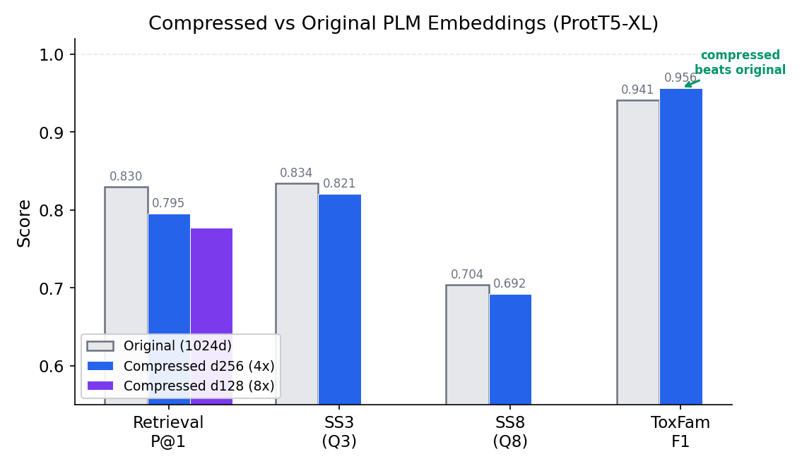
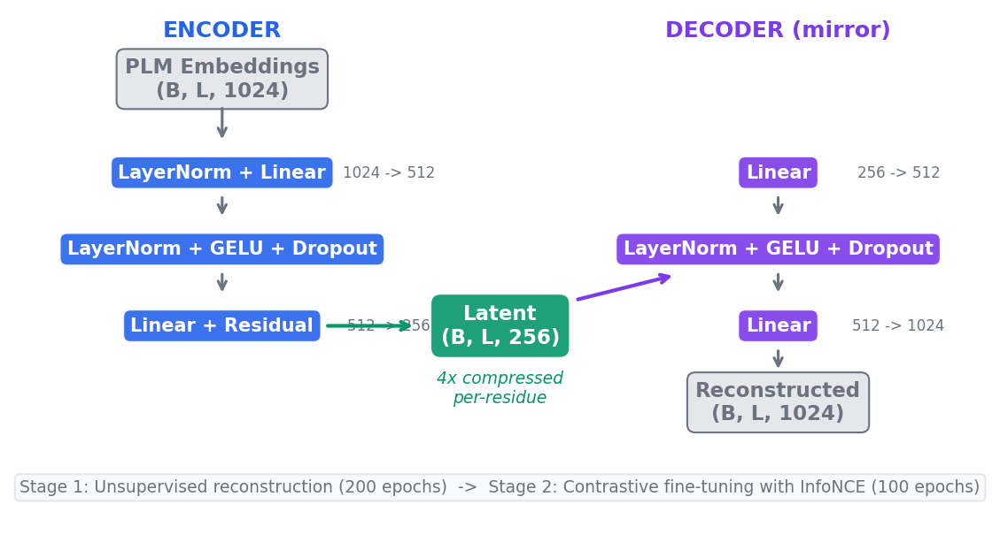
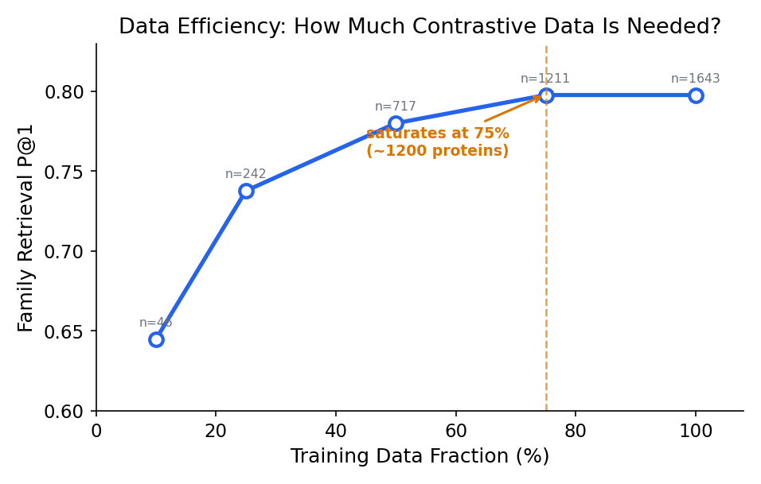
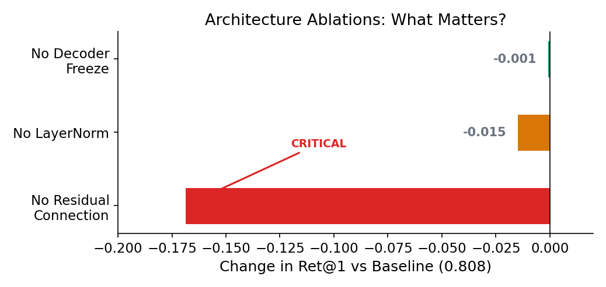
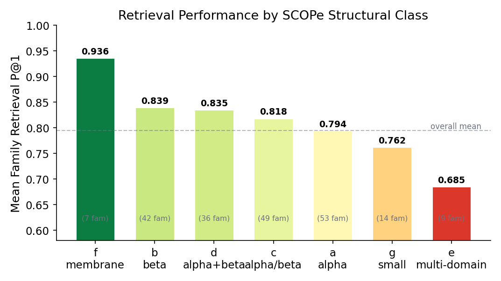

# Protein Embedding Compression Explorer

Sequence-only learned compressor that reduces PLM per-residue embeddings from 1024d to 128-256d (4-8x compression) while retaining >98% downstream task utility. No structure model required.

## Key Results



| Metric | d256 (4x) | d128 (8x) | Original (1024d) |
|--------|:---------:|:---------:|:-----------------:|
| Family Retrieval P@1 | **0.795 +/- 0.012** | **0.777 +/- 0.005** | 0.830 |
| SS3 Accuracy (Q3) | 0.821 | -- | 0.834 |
| SS8 Accuracy (Q8) | 0.692 | -- | 0.704 |
| ToxFam F1 | **0.956** | -- | 0.941 |

3-seed mean on ProtT5-XL ChannelCompressor (seeds 42, 123, 456). Per-residue structure retention: Q3 0.985-0.990. Compressed embeddings **outperform** originals on toxicity classification.

## Architecture



**Training**: Unsupervised reconstruction (200 epochs) then contrastive fine-tuning with InfoNCE + family labels (100 epochs, decoder frozen).

## Quick Start

```bash
# Setup (requires Python 3.12, uv package manager)
uv sync

# Core pipeline
uv run python experiments/01_extract_residue_embeddings.py  # Extract PLM embeddings
uv run python experiments/02_baseline_benchmarks.py          # PCA/mean-pool baselines
uv run python experiments/11_channel_compression.py          # Train ChannelCompressor
uv run python experiments/13_robust_validation.py --step R1  # Multi-seed validation
uv run python experiments/13_robust_validation.py --step R3  # Cross-dataset probes
```

## Scientific Findings

1. **"One embedding" works** -- a contrastive checkpoint retains >98% per-residue structure prediction utility despite never seeing structure labels.
2. **Reconstruction != utility** -- cosine similarity drops 0.89 to 0.59 after contrastive fine-tuning, but Q3/Q8 barely changes.
3. **Sequential > joint** -- two-head joint training (0.659) underperforms the sequential pipeline (0.795).
4. **Compressed can beat original** -- ToxFam toxicity F1: 0.956 (256d) vs 0.941 (1024d).
5. **8x compression is viable** -- d128 contrastive retains 97.7% of d256 retrieval with lower seed variance.
6. **Residual connections are critical** -- removing them drops Ret@1 by 0.169; LayerNorm and decoder freezing have minimal impact.
7. **~1200 proteins suffice** -- performance saturates at 75% of training data.
8. **Mean pool is optimal for contrastive-trained PLMs** -- DCT, Haar, autocovariance, Fisher vectors, Gram features, and 6 enrichment strategies all fail to significantly beat mean pooling on contrastive-optimized ProtT5 (best enriched: 0.809 vs mean: 0.808, p=0.754).
9. **Spectral transforms + PCA are a free lunch for un-tuned PLMs** -- ESM2 DCT K=8+PCA: Ret@1=0.784 (+3.7pp vs mean 0.747). The curse of dimensionality, not the math, was the bottleneck.
10. **Brillouin hypothesis rejected** -- spectral fingerprint (phase-free PSD) does NOT correlate better with protein structure than mean pool. Phase carries essential discriminative information.

## Requirements

- Python 3.12, [uv](https://docs.astral.sh/uv/) package manager
- PyTorch >= 2.0 with MPS (Apple Silicon) or CUDA
- ~10 GB disk for embeddings and checkpoints

```bash
uv sync  # Installs all dependencies from pyproject.toml
```

## License

MIT. See [LICENSE](LICENSE).

---

## Appendix A: Cross-Dataset Transfer

Trained on SCOPe structural families, tested on fully independent benchmarks:

| Benchmark | Task | Metric | Score |
|-----------|------|--------|:-----:|
| TS115 | Secondary structure | SS3 Accuracy | 0.821 |
| CheZOD | Disorder prediction | Spearman rho | 0.518 |
| TMbed | Membrane topology | F1 | 0.657 |
| ToxFam | Toxicity classification | F1 | 0.956 |

## Appendix B: Scaling and Robustness

### Data Efficiency



| Training Fraction | Proteins | Families | Ret@1 |
|:-----------------:|:--------:|:--------:|:-----:|
| 10% | 46 | 22 | 0.645 |
| 25% | 242 | 107 | 0.738 |
| 50% | 717 | 269 | 0.780 |
| 75% | 1211 | 369 | 0.798 |
| 100% | 1643 | 395 | 0.798 |

### Hyperparameter Robustness

30-trial Optuna HPO confirmed near-optimality: HPO best 0.801 +/- 0.001 vs baseline 0.795 +/- 0.012 (p=0.29, not significant).

### Architecture Ablations



| Ablation | Ret@1 | Delta | CosSim |
|----------|:-----:|:-----:|:------:|
| Baseline | 0.808 | -- | 0.59 |
| No LayerNorm | 0.793 | -0.015 | 0.756 |
| No Residual | 0.639 | -0.169 | 0.287 |
| No Decoder Freeze | 0.807 | -0.001 | 0.828 |

Unfreezing the decoder during contrastive fine-tuning is a free lunch: same retrieval, much better reconstruction.

### Failure Analysis



122/210 test families (58%) achieve perfect Ret@1=1.0. Only 6 (3%) completely fail. No correlation with family size (r=-0.091) or sequence length (r=-0.003).

## Appendix C: Compression Comparison (ProtT5-XL)

| Dimension | Compression | Ret@1 (3-seed) | Seed StdDev |
|:---------:|:-----------:|:--------------:|:-----------:|
| d256 | 4x | 0.795 +/- 0.012 | 0.012 |
| d128 | 8x | 0.777 +/- 0.005 | 0.005 |

## Appendix D: Project Structure

```
src/
  compressors/
    base.py                 SequenceCompressor ABC
    channel_compressor.py   ChannelCompressor (pointwise MLP, best method)
    attention_pool.py       Cross-attention pooling (explored, superseded)
    mean_pool.py            Mean pooling baseline
  extraction/
    esm_extractor.py        ESM2 embedding extraction
    prot_t5_extractor.py    ProtT5 embedding extraction
    data_loader.py          FASTA/metadata I/O, SCOPe curation
  training/
    trainer.py              Unified training loop with early stopping
    objectives.py           InfoNCE, reconstruction, masked prediction losses
  evaluation/
    retrieval.py            kNN retrieval (P@K, MRR, MAP)
    classification.py       Linear probe with held-out or cross-validation
    reconstruction.py       MSE + cosine similarity metrics
    per_residue_tasks.py    SS3/SS8/CheZOD/TMbed probes
    statistical_tests.py    Paired bootstrap, permutation tests, Cohen's d
    structural_validation.py  TM-score structural validation
    splitting.py            Superfamily-aware train/test splitting
  one_embedding/
    transforms.py           DCT, Haar wavelet, spectral transforms
    enriched_transforms.py  Moment pool, autocovariance, Gram, Fisher vector + PCA pipeline
    embedding.py            OneEmbedding dataclass
    pipeline.py, io.py, similarity.py, registry.py

experiments/
  01_extract_residue_embeddings.py  PLM embedding extraction
  02_baseline_benchmarks.py         PCA/mean-pool baselines
  03_quick_comparison.py            Strategy comparison
  04_narrowing.py                   Narrowing best strategies
  11_channel_compression.py         ChannelCompressor training + evaluation
  12_per_residue_validation.py      CB513 per-residue benchmarks
  13_robust_validation.py           Multi-seed + cross-dataset validation
  14_two_head_training.py           Joint training (negative result)
  15_external_validation.py         ToxFam + TMbed PCA external validation
  16_hpo_contrastive.py             Optuna hyperparameter optimization
  17_scaling_and_ablations.py       Scaling curves, failure analysis, ablations
  18_one_embedding.py               One Embedding transforms + structural validation
  19_enriched_pooling.py            Enriched pooling (6 transforms + PCA)
  validate_split_leakage.py         MMseqs2 split leakage validation
  archive/                          Superseded exploration scripts (phases 5-10)

data/
  proteins/                FASTA files + metadata CSVs
  residue_embeddings/      H5 files with per-residue embeddings
  checkpoints/channel/     Model weights
  benchmarks/              JSON result files
  splits/                  Train/test split definitions
```

## Appendix E: Further Reading

- [ANALYSIS.md](ANALYSIS.md) -- comprehensive cross-phase results with statistical tests
- [STRATEGY.md](STRATEGY.md) -- phase-by-phase exploration log
