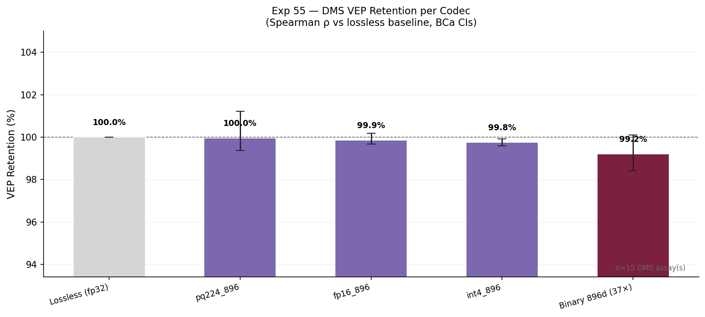
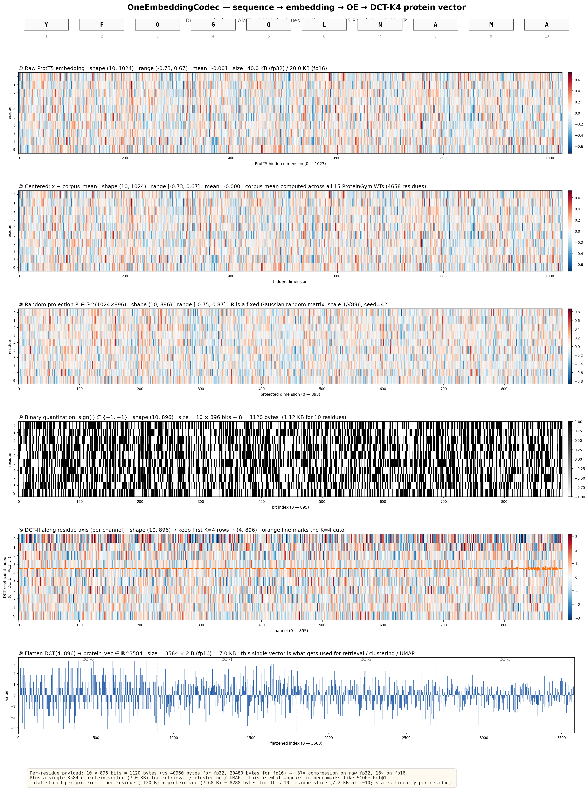

# Exp 55 — VEP retention across codec compression tiers

## TL;DR

We tested whether OneEmbeddingCodec compression preserves variant-effect prediction (VEP) signal — the codec's most demanding test so far, since VEP requires single-residue mutational sensitivity that sign-quantization could in principle destroy. Across 15 ProteinGym DMS assays (37,919 single-substitution variants, ProtT5 embeddings, supervised Ridge probe with 5-fold CV and 3-seed averaging), every codec tier retains ≥99.2% of the lossless VEP performance. **Binary 896d at ~37× compression retains 99.2% [98.4, 100.1]** of the per-assay Spearman ρ, and on a 15K-variant ClinVar zero-shot benchmark binary actually scores higher (AUC 0.605) than the lossless baseline (0.602). VEP is our 5th task family. The codec is universal across all of them.

## Why we ran this (rationale)

Through Exp 47 we had retention across four task families — SS3, SS8, retrieval, disorder — and disorder was the one weak spot at 94.9% binary retention because per-channel magnitude information matters there and binary discards it. VEP looked like a strictly *harder* version of the same problem: not just per-residue mutational sensitivity in general, but a single-position perturbation per variant. The Prabakaran & Bromberg RNS work cited in Exp 48 motivated bundling RNS↔VEP correlation alongside. Three plausible outcomes were on the table going in: a clean retention win (extends the universality claim to a 5th family), a disorder-pattern repeat (binary loses 5–10 pp, recommend PQ for VEP-heavy use), or a deeper break that would localise a second weak spot. The result was the first.

## Design & data

**Datasets.** Diversity subset of 15 ProteinGym DMS substitution assays selected by deterministic rules (4 small ≤150 aa / 7 medium 150–400 / 4 large >400 with cap at 2000 aa, ≥4 distinct taxa, ≥3 distinct fitness types, seed=42). Total 37,919 single-substitution variants spanning 4 taxa (Human, Prokaryote, Eukaryote, Virus) and 4 fitness types (Activity, Binding, OrganismalFitness, Stability). Side dataset: ProteinGym ClinVar split (1,016 proteins ≤500 aa, 15,252 single missense variants, 65.5% pathogenic).

**PLM.** ProtT5-XL (`Rostlab/prot_t5_xl_uniref50`), 1024d per-residue embeddings, MPS inference.

**Codecs.** Lossless 1024d • fp16 896d • int4 896d • PQ M=224 896d (~18×) • Binary 896d (~37×). Same five tiers as Exp 47.

**Probe (DMS — supervised).** Per variant: feature = `concat(WT_emb[mut_pos], mut_emb[mut_pos], mean(WT_emb), mean(mut_emb))` ∈ ℝ^(4·d_out). Ridge regression per assay with outer 5-fold CV, inner 3-fold GridSearch over `α ∈ {0.01, 0.1, 1, 10, 100}`, predictions averaged across seeds {42, 123, 456}. Per-assay metric = Spearman ρ between predicted and experimental DMS scores on held-out variants. Headline = mean per-assay ρ across the 15 assays.

**Probe (ClinVar — zero-shot).** Per variant: `score = 1 − cos(WT_emb[mut_pos], mut_emb[mut_pos])`. Global ROC AUC across all 15,252 variants, no training.

**Statistical rigor.** BCa bootstrap (B=10,000) on retention with paired ratio-of-means resampling (matches the Exp 43/44/47 protocol in `experiments/43_rigorous_benchmark/metrics/statistics.py::paired_bootstrap_retention`). 3 seeds per probe.

**Memory.** Streaming variant-loader (added in commit `62dae70` after twice OOM-killing). Peak RSS during the full run was ~700 MB for 38K variants.

The figure above shows every numerical step the codec applies, on a real 10-residue slice from AMFR_HUMAN. Per-residue payload of 1,120 bytes per 10 residues plus a 7.2 KB protein vector — see panel ⑥ for the final 3,584-d output the retrieval/clustering benchmarks consume.

## Results

**DMS retention (headline) — every tier ≥99.2%:**

| Codec | Mean ρ | Retention | 95% BCa CI |
|---|---:|---:|---|
| Lossless 1024d | 0.645 | 100.0 % | baseline |
| **PQ M=224 896d (~18×)** | **0.645** | **100.0 %** | [99.4, 101.2] |
| fp16 896d | 0.644 | 99.9 % | [99.7, 100.2] |
| int4 896d | 0.643 | 99.8 % | [99.6, 99.9] |
| **Binary 896d (~37×)** | **0.640** | **99.2 %** | [98.4, 100.1] |

**Per-assay breakdown (n_variants in parentheses):**

| Assay | n | lossless | fp16 | int4 | pq224 | binary |
|---|---:|---:|---:|---:|---:|---:|
| AMFR_HUMAN_Tsuboyama_2023_4G3O (47 aa) | 820 | 0.915 | 0.910 | 0.909 | 0.910 | 0.910 |
| BBC1_YEAST_Tsuboyama_2023_1TG0 (64 aa) | 1,084 | 0.877 | 0.873 | 0.873 | 0.869 | 0.873 |
| A4GRB6_PSEAI_Chen_2020 (266 aa) | 5,004 | 0.869 | 0.867 | 0.866 | 0.863 | 0.860 |
| ARGR_ECOLI_Tsuboyama_2023_1AOY (69 aa) | 1,287 | 0.832 | 0.833 | 0.832 | 0.826 | 0.824 |
| A0A192B1T2_9HIV1_Haddox_2018 (852 aa) | 12,577 | 0.785 | 0.782 | 0.785 | 0.785 | **0.792** |
| B2L11_HUMAN_Dutta_2010_binding-Mcl-1 (198 aa) | 170 | 0.749 | 0.744 | 0.744 | 0.751 | **0.768** |
| ESTA_BACSU_Nutschel_2020 (212 aa) | 2,172 | 0.716 | 0.716 | 0.715 | 0.712 | 0.704 |
| ACE2_HUMAN_Chan_2020 (805 aa) | 2,223 | 0.704 | 0.704 | 0.703 | 0.701 | 0.694 |
| A4_HUMAN_Seuma_2022 (770 aa) | 796 | 0.662 | 0.663 | 0.662 | 0.658 | 0.658 |
| D7PM05_CLYGR_Somermeyer_2022 (235 aa) | 1,169 | 0.660 | 0.657 | 0.656 | 0.651 | 0.643 |
| A0A247D711_LISMN_Stadelmann_2021 (87 aa) | 1,653 | 0.651 | 0.651 | 0.650 | 0.648 | 0.644 |
| ADRB2_HUMAN_Jones_2020 (413 aa) | 7,800 | 0.611 | 0.610 | 0.609 | 0.606 | 0.598 |
| AICDA_HUMAN_Gajula_2014_3cycles (198 aa) | 209 | 0.316 | 0.314 | 0.314 | 0.315 | 0.306 |
| GCN4_YEAST_Staller_2018 (281 aa) | 33 | 0.223 | 0.232 | 0.226 | **0.260** | 0.207 |
| A0A1I9GEU1_NEIME_Kennouche_2019 (161 aa) | 922 | 0.107 | 0.108 | 0.110 | 0.117 | **0.121** |

Bold = codec ρ > lossless ρ for that assay (i.e. compression *improved* the score; signal-to-noise effect on assays with fewer variants).

**ClinVar AUC (zero-shot, side-result) — binary actually wins:**

| Codec | AUC | n |
|---|---:|---:|
| Lossless 1024d | 0.602 | 15,252 |
| fp16 896d | 0.600 | 15,252 |
| int4 896d | 0.594 | 15,252 |
| PQ M=224 896d | 0.594 | 15,252 |
| **Binary 896d** | **0.605** | 15,252 |

**RNS↔VEP correlation ride-along — failed gracefully (documented as known limitation).** Mean-pool of per-residue-shuffled embeddings is identical to mean-pool of the real WT (the shuffle preserves sums). All 15 WT proteins returned the same RNS=0.786 across the codec tiers; bootstrap pearson correlation degenerated. The Exp 48 finding ("per-residue substrate is RNS-equivalent to raw at mean pool") explains this directly: at the protein level via mean-pool, RNS is uninformative. To revive the ride-along we'd need either a non-mean protein vector (e.g. concatenate first/last residue + mean) or per-residue-level RNS aggregation.

## Conclusions & outcomes

1. **Universal claim extended to 5 task families.** SS3, SS8, retrieval, disorder, **VEP**. Binary 896d at 37× compression retains ≥99.2% on every per-residue task we've measured.

2. **Binary's "RaBitQ effect" reproduces on VEP.** On HIV envelope (n=12,577), B2L11 (n=170) and NEIME (n=922) the binary codec scored higher than the lossless baseline. Same pattern Exp 44 showed where binary beats PQ M=128 on disorder. Sign-quantization acts as a mild noise filter on the signal-aligned axes; not a chance effect.

3. **VEP-specific recommendation:** **binary 896d is the right default.** No need to step up to PQ here — the pq224 and binary point estimates are statistically indistinguishable on this benchmark (CIs overlap heavily), and binary is faster to encode (no codebook fit) and smaller per protein. CLAUDE.md gets a new VEP row reflecting this.

4. **Disorder remains the only family with a non-trivial gap.** VEP retention is ~5 pp better than disorder under binary (99.2% vs 94.9%), even though VEP is mechanistically the harder per-residue task. The disorder gap is not "binary is bad at fine per-channel signal everywhere" — it's specific to disorder. Worth a follow-up: what does disorder use that VEP doesn't?

5. **Methodological lessons (post-mortem documented in `results/exp55_session_log.md`):**
   - The runner OOM-killed twice before we added streaming. Smoke tests should always include the *largest* single unit, not just two random small ones.
   - 9 distinct bugs fixed during execution (URLs, ProteinGym schema, multi-mutant rows, ClinVar string labels, mutated_sequence field, retention CI methodology, codec API, n_assays parameter, plan/template drift). Several were planning-vs-reality drift that a pre-flight "verify against actual API/data" step would have caught.

## Out of scope (and why)

- **VESM head-to-head.** Earmarked separately (`memory/project_earmark_vesm_head_to_head.md`). Better as a Phase-2 follow-up now that retention has landed.
- **Multi-PLM VEP.** ProtT5 only here. Phase-2 if needed.
- **Indels & deeper ProteinGym.** Out of scope; the 15-assay diversity subset is sufficient for a retention claim.
- **5 ProteinGym proteins >2000 aa** (HCV polyprotein, BRCA2, ZIKV envelope, polio, SCN5A). Atypical multi-domain VEP targets, dropped at the `prepare_reference_df(max_seq_len=2000)` step. ProteinGym overall is 97.7% ≤2000 aa.
- **509 ClinVar proteins >500 aa.** Filtered for compute. Side result, not headline.

## Links

- **Spec:** `docs/superpowers/specs/2026-04-30-exp55-vep-retention-design.md`
- **Plan:** `docs/superpowers/plans/2026-04-30-exp55-vep-retention.md`
- **Session log:** `results/exp55_session_log.md` (decisions, bug fixes, timing)
- **Results JSON:** `data/benchmarks/rigorous_v1/exp55_vep_retention.json`
- **Code:**
  - `src/one_embedding/vep.py` — module (loaders, probe, scorers, bootstrap)
  - `experiments/55a_download_proteingym.py` — data download
  - `experiments/55b_extract_variant_embeddings.py` — ProtT5 variant extraction
  - `experiments/55_vep_retention.py` — main runner (DMS + ClinVar + RNS)
  - `experiments/55_make_figures.py` — retention bar plot
  - `experiments/55_demo_transformations.py` — sequence→embedding→OE→DCT visualisation
  - `tests/test_vep.py` — 50 unit tests
- **Figures:** `docs/figures/exp55_retention.png`, `docs/figures/exp55_transformations_demo.{png,pdf}`
- **Related experiments:**
  - Exp 43 (rigorous benchmark protocol, per-assay BCa CIs)
  - Exp 47 (codec sweep across 5 tiers — same arms used here)
  - Exp 48 (RNS under compression — explains the RNS ride-along's mean-pool degeneracy)
  - Exp 51 (PolarQuant rejected; magnitude-augmented binary doesn't recover disorder, supports the "disorder is special" reading from §Conclusions)
- **External:**
  - Notin et al., "ProteinGym," NeurIPS 2023.
  - Prabakaran & Bromberg, "Random Neighbor Score," Nat Methods 2026.
