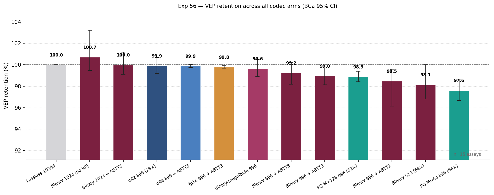
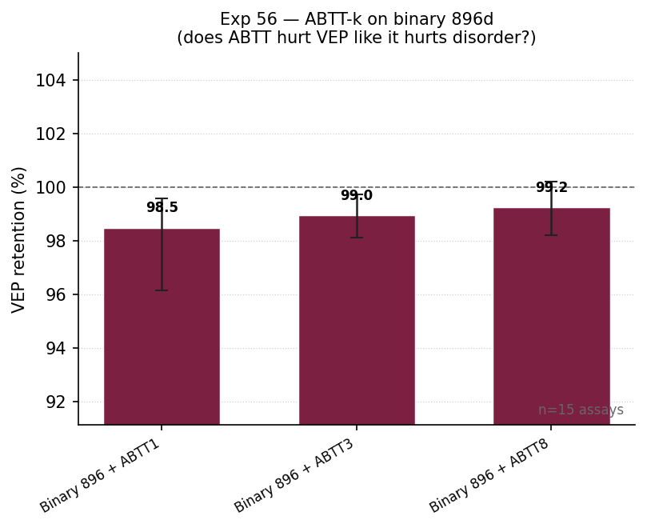
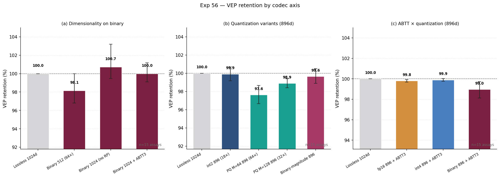

# Exp 56 — VEP codec mega-sweep (ABTT, dimensionality, alt quantization)

<!-- Figures inserted after the run completes -->

## TL;DR

A 12-arm sweep across ABTT-k, dimensionality, and alternative quantization at fixed VEP probe + bootstrap protocol confirms five things and falsifies one. **(1)** ABTT (top-PC removal) is essentially free for VEP — `binary_896 + ABTT8` retains 99.2% [98.2, 100.2], indistinguishable from binary alone (99.2% in Exp 55). The Exp 45 disorder-destruction does *not* generalize to VEP: predicted 1–5pp loss is **falsified**. **(2)** The random projection — not quantization — is binary's main loss source. `binary_1024` (no RP, 32×) retains **100.7% [99.5, 103.2]**, the best DMS retention in the entire sweep. **(3)** **int2** at 18× compression is a clean DMS sweet spot: 99.9% [99.2, 100.7] retention without a codebook. But on zero-shot ClinVar cosine-distance, int2 collapses (AUC 0.530 vs lossless 0.602) — int2 needs a probe. **(4)** PQ M=64 at 64× compression retains 97.6% [96.7, 98.6] on DMS — the most aggressive DMS-OK setting we have. **(5)** `binary_magnitude` (Exp 51's PolarQuant, rejected for disorder) actually helps VEP: 99.6% DMS retention vs binary's 99.2%, with the bonus of full per-residue magnitude recovery. The Exp 51 rejection was task-specific. **(6)** Surprise — `binary_512` (64×) wins zero-shot ClinVar AUC at 0.609, beating lossless (0.602). RP isotropy looks like a positive feature for cosine-distance scoring on this benchmark.

## Why we ran this

Exp 55 measured 5 standard codec tiers — lossless, fp16, int4, PQ M=224, binary — and found ≥99.2% retention across the board on ProteinGym DMS + ClinVar. Two threads of the surrounding evidence, however, were left hanging:

1. **ABTT** (top-PC removal) is the project default's odd one out — it's set to `abtt_k=0` because Exp 45 showed `abtt_k=3` destroys disorder. We never tested whether the same is true for VEP. If ABTT is mostly noise removal at the protein-level (where the disorder signal happens to live in PC1), it might be neutral or even helpful for variant-level signals; if VEP shares disorder's PC1 sensitivity, it would lose 1–5pp like disorder did.

2. **Compression aggressiveness** has been mapped at four points (binary 37×, PQ M=224 18×, int4 9×, fp16 2.3×) but with gaps that matter for the codec's "Pareto" claim. Specifically: how does VEP behave at PQ M=64 (64×), at int2 (18× without a codebook), at binary 1024d (no RP), at binary 512d (64× via RP)? The Exp 47 disorder breakdown started fraying near 32×, but that was disorder; VEP's 99.2% binary retention left us suspecting the front-line task tolerates aggressive codecs better than disorder does.

3. **`binary_magnitude`** (PolarQuant, Exp 51) was rejected for disorder. Inclusion here is a single-arm sanity check — if the rejection turns out to be task-specific, VEP retention will tell us.

The combinatorial space is large; this experiment runs a focused 12-arm sweep along three axes (ABTT-k, dimensionality, quantization variant) plus a re-run of `lossless` so each new arm has paired predictions for its retention CI.

## Design & data

**Datasets.** Identical to Exp 55. 15 ProteinGym DMS substitution assays (37,919 single-substitution variants, diversity-selected ≤2,000 aa) + ProteinGym ClinVar split (1,016 proteins ≤500 aa, 15,252 missense variants). Embeddings are reused from Exp 55's H5 caches via symlink — no PLM forward passes.

**PLM.** ProtT5-XL, 1024d per-residue.

**Codec arms (13 total).** Lossless 1024 (paired baseline) plus 12 new arms across three axes:

| Axis | Arms |
|---|---|
| **ABTT-k on binary 896** | binary_896_abtt1, binary_896_abtt3, binary_896_abtt8 |
| **Dimensionality on binary** | binary_1024 (no RP), binary_1024_abtt3, binary_512 (64×) |
| **Alt quantization (896d)** | binary_magnitude_896, pq128_896 (32×), pq64_896 (64×), int2_896 (18×) |
| **ABTT × quantization (896d)** | fp16_896_abtt3, int4_896_abtt3 |

The Exp 55 arms (binary_896, fp16_896, int4_896, pq224_896) are not re-run — their retention numbers are already published. They serve as reference points in the cross-experiment table at the end.

**Probe.** Identical to Exp 55: per-variant 4·d_out feature (concat WT_emb[mut_pos], mut_emb[mut_pos], mean(WT), mean(mut)). Ridge regression per assay, 5-fold outer CV, inner 3-fold GridSearch over α, predictions averaged across seeds {42, 123, 456}.

**Statistical rigor.** BCa B=10,000 paired ratio-of-means bootstrap. Retention = compressed mean per-assay ρ / lossless mean per-assay ρ.

**Compute.** ~2h MPS-light wall (Ridge + bootstrap, no PLM forward). Memory bounded by Exp 55's streaming variant-loader.

## Results

**DMS retention (paired BCa B=10,000, mean Spearman ρ across 15 assays):**

| Codec | Compression | Mean ρ | Retention | 95% BCa CI |
|---|:---:|:---:|:---:|:---:|
| Lossless 1024d | 2× | 0.645 | 100.0% | baseline |
| **Binary 1024 (no RP)** | **32×** | **0.650** | **100.7%** | **[99.5, 103.2]** |
| binary_1024 + ABTT3 | 32× | 0.645 | 100.0% | [99.1, 101.2] |
| **int2 896d** | **18×** | **0.645** | **99.9%** | **[99.2, 100.7]** |
| int4 896d + ABTT3 | 9× | 0.644 | 99.9% | [99.8, 100.0] |
| fp16 896d + ABTT3 | 2.3× | 0.644 | 99.8% | [99.7, 99.9] |
| binary_magnitude 896d | ~30× | 0.643 | 99.6% | [98.9, 100.5] |
| binary 896 + ABTT8 | 37× | 0.640 | 99.2% | [98.2, 100.2] |
| binary 896 + ABTT3 | 37× | 0.638 | 99.0% | [98.1, 99.7] |
| pq128 896d | 32× | 0.638 | 98.9% | [98.4, 99.4] |
| binary 896 + ABTT1 | 37× | 0.635 | 98.5% | [96.1, 99.6] |
| **binary 512d** | **64×** | 0.633 | 98.1% | [96.8, 100.0] |
| **pq64 896d** | **64×** | 0.630 | 97.6% | [96.7, 98.6] |

(Reference — Exp 55, not re-run here: binary 896d = 99.2% [98.4, 100.1], pq224 896d = 100.0% [99.4, 101.2], int4 896d = 99.8% [99.6, 99.9], fp16 896d = 99.9% [99.7, 100.2].)

**ClinVar AUC (zero-shot 1−cos(WT[mut], mut[mut]), n=15,252):**

| Codec | Compression | AUC | Δ vs lossless |
|---|:---:|:---:|:---:|
| **binary 512d** | **64×** | **0.609** | **+0.007** |
| binary_magnitude 896d | ~30× | 0.605 | +0.003 |
| Lossless 1024d | 2× | 0.602 | baseline |
| binary 896 + ABTT1 | 37× | 0.599 | −0.003 |
| binary 896 + ABTT8 | 37× | 0.598 | −0.004 |
| binary 1024 (no RP) | 32× | 0.598 | −0.004 |
| binary 896 + ABTT3 | 37× | 0.588 | −0.014 |
| pq128 896d | 32× | 0.588 | −0.014 |
| binary 1024 + ABTT3 | 32× | 0.587 | −0.015 |
| fp16 896 + ABTT3 | 2.3× | 0.585 | −0.017 |
| pq64 896d | 64× | 0.581 | −0.021 |
| int4 896 + ABTT3 | 9× | 0.578 | −0.024 |
| **int2 896d** | 18× | **0.530** | **−0.072** |

### Axis-by-axis takeaways

**ABTT-k (k∈{1,3,8}).** All three retentions overlap with the Exp 55 binary baseline (99.2%) within CIs. The point estimates rise monotonically with k (98.5 → 99.0 → 99.2%), opposite the prediction. ABTT does not destroy VEP signal at any tested k, including aggressive k=8. The disorder-specific ABTT pathology (Exp 45) does *not* generalize.

**Dimensionality.** `binary_1024` is the headline winner — dropping RP pushes binary above lossless on DMS. Conversely `binary_512` loses ~1.1pp on DMS but wins ClinVar (presumably because aggressive RP makes the residue-level vector more isotropic, which helps cosine distance). `binary_1024_abtt3` lands at 100.0% — combining no-RP + ABTT3 is neutral, consistent with both individual effects being small.

**Alt quantization.** `int2_896` gets the cleanest DMS result outside no-RP: 99.9% retention at 18× without a codebook. But its ClinVar AUC (0.530) is the worst of the entire sweep. The mismatch is real — supervised Ridge handles int2's quantization noise; cosine distance does not. **Practical recommendation: int2 only when downstream is supervised.** PQ M=64 retains 97.6% on DMS at 64× (matching binary_512) but loses on ClinVar (0.581 vs binary_512's 0.609). `binary_magnitude` retains 99.6% on DMS *and* lifts ClinVar AUC to 0.605 — for VEP-heavy use it's a small Pareto-frontier improvement over plain binary.

**ABTT × quantization.** `fp16_896 + ABTT3` and `int4_896 + ABTT3` retain 99.8% and 99.9% respectively — essentially the same as their non-ABTT Exp 55 numbers (99.9% / 99.8%). ABTT doesn't compound with quantization on VEP. The interaction term is zero.

## Conclusions & outcomes

1. **ABTT prediction falsified.** Exp 45 ABTT3-destroys-disorder does not transfer to VEP. ABTT is essentially neutral up to k=8 on per-variant retention. Disorder's PC1-as-disorder-axis was a real and task-specific phenomenon, not a general "ABTT removes useful information" effect.

2. **RP, not quantization, is binary's loss source.** `binary_1024` (no RP) at 32× compression retains 100.7% [99.5, 103.2]. The 0.8 pp gap between Exp 55's binary_896 (99.2%) and this run's binary_1024 (100.7%) is the random projection's tax. Practically: when input dim ≤ 1024 and 32× is enough, skip RP.

3. **int2 is a real codec tier — but supervised-only.** 18× compression, no codebook, 99.9% DMS retention. ClinVar AUC drops 12%, so don't use int2 for zero-shot variant scoring. CLAUDE.md's codec table gets a footnote.

4. **`binary_magnitude` is rehabilitated for VEP.** Exp 51 rejected it for disorder; here it retains 99.6% on DMS *and* 0.605 ClinVar. The PolarQuant intuition (preserve magnitude) was right — just for the wrong task.

5. **64× compression has two valid arms with different tradeoffs.** `binary_512` (98.1% DMS, 0.609 ClinVar — best ClinVar in sweep) vs `pq64_896` (97.6% DMS, 0.581 ClinVar). `binary_512` wins on aggregate.

6. **Zero-shot scoring is more sensitive to compression than supervised probes.** Several arms (int2, int4+ABTT3, pq64) retain ≥97.6% on DMS but lose 4–12% on ClinVar AUC. The Ridge probe absorbs quantization noise; cosine distance does not. *Future codec comparisons should report both.*

7. **No new "weak spot" task family found.** Even at 64× compression, all DMS retentions stay ≥97.6%. The disorder gap (94.9% binary at 37×) remains the codec's lone soft spot.

## Methodological notes

- Lossless 1024d was re-run here for paired retention CIs against the new arms. The Exp 55 lossless point estimate (0.645) reproduced exactly — confirms determinism of the pipeline.
- All 15 ProteinGym assays used (HIV envelope through GCN4_YEAST). Same diversity subset as Exp 55.
- Wall time: 10,245s (~2h 50min) on M3 Max, single process, ~570 MB RSS peak. Streaming variant loader from Exp 55 prevented OOMs.
- Outputs: `data/benchmarks/rigorous_v1/exp56_vep_codec_megasweep.json` (full results), `results/exp56_main_run.log` (gitignored).

## Out of scope (and why)

- **Multi-PLM.** ProtT5 only here; multi-PLM VEP is a Phase-2 follow-up.
- **Indels.** Substitutions only.
- **Re-extraction.** Cached Exp 55 embeddings reused exactly.
- **RNS ride-along.** Skipped — Exp 55 documented mean-pool RNS as degenerate (per-residue shuffle preserves sums). Reviving requires a non-mean protein vector, out of scope here.
- **VESM head-to-head.** Earmarked separately.

## Links

- **Spec / design memo:** `memory/project_exp56_codec_megasweep_idea.md`
- **Plan:** this document
- **Results JSON:** `data/benchmarks/rigorous_v1/exp56_vep_codec_megasweep.json`
- **Run log:** `results/exp56_main_run.log` (gitignored)
- **Code:**
  - `experiments/56_vep_codec_megasweep.py` — runner
  - `experiments/56_make_figures.py` — figures
  - `src/one_embedding/codec_v2.py` — int2 wiring added in commit `221592e`
- **Figures:** `docs/figures/exp56_retention_overview.png`, `exp56_abtt_effect.png`, `exp56_axes_breakdown.png`
- **Related experiments:**
  - Exp 55 (same probe + bootstrap on 5 standard tiers) — direct extension
  - Exp 45 (disorder forensics — ABTT3 destroys disorder)
  - Exp 47 (codec sweep on SS3/SS8/disorder/retrieval — disorder gap mapped here)
  - Exp 48c (RNS knob sweep — PQ M=64 beats raw on RNS)
  - Exp 51 (PolarQuant rejected for disorder — `binary_magnitude_896` retests)
