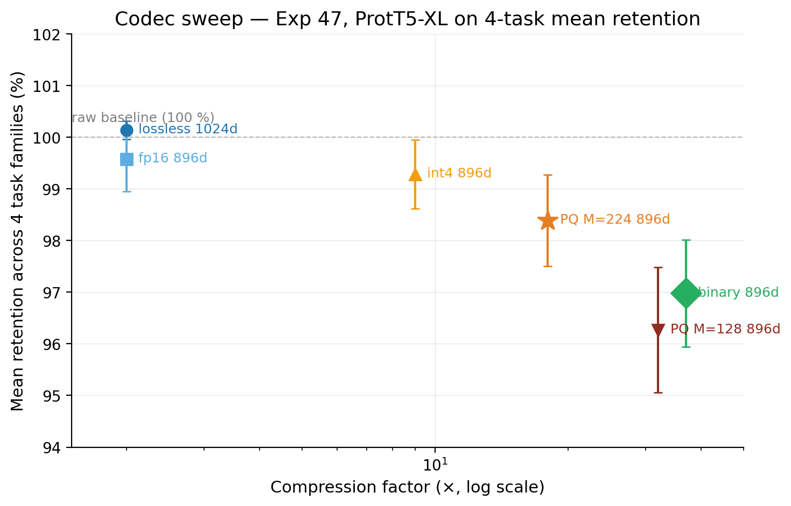
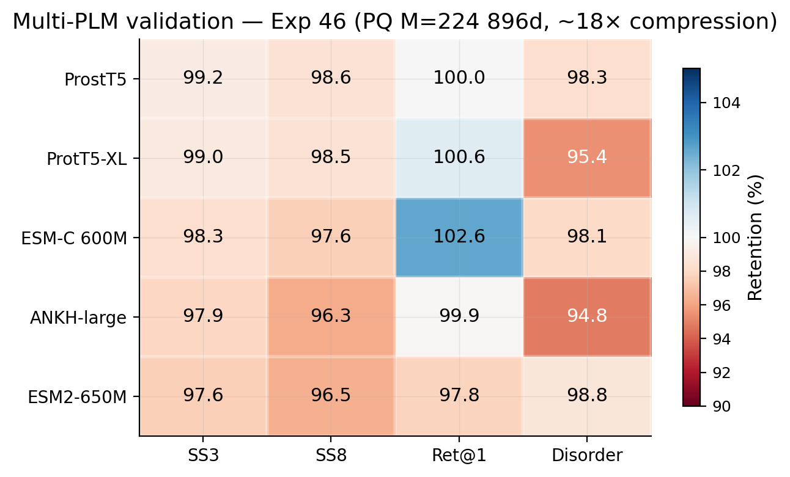
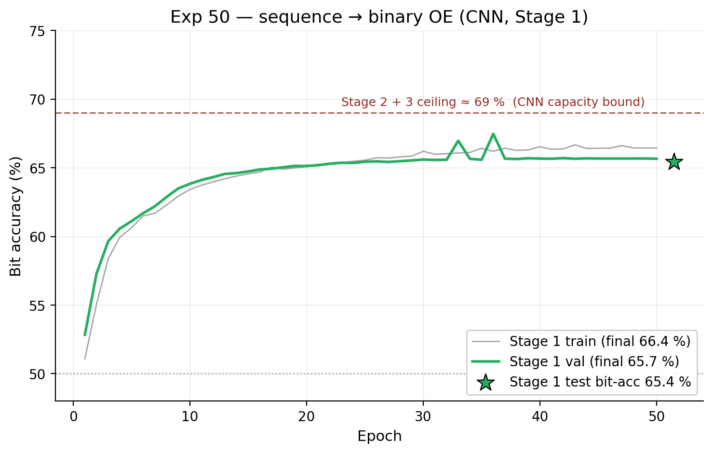

<!-- _class: lead -->
<!-- _paginate: skip -->

# OneEmbedding
## A universal codec for PLM per-residue embeddings

Validated across 5 PLMs · 4 task families · with rigorous BCa confidence intervals

<br>

**Ivan** · Rost lab seminar · 2026

<!-- source: docs/STATE_OF_THE_PROJECT.md @ commit bac545a -->

---

## The problem

Protein language models emit **per-residue tensors** `(L, D)` per protein:

| PLM | D | size for 5K proteins (fp16) |
|---|:---:|:---:|
| ProtT5-XL | 1024 | ~5 GB |
| ESM2-650M | 1280 | ~6 GB |
| ESM-C 600M | 1152 | ~5 GB |
| ANKH-large | 1536 | ~7 GB |

UniProt is **250 M proteins**. Storing, shipping, and searching raw embeddings at scale is impractical.

**Goal:** compress without losing downstream task performance.

<!-- source: docs/STATE_OF_THE_PROJECT.md § "Executive summary" -->

---

## Method — one class, four knobs

```python
codec = OneEmbeddingCodec()  # default: 896d binary, ~37x, no codebook
codec.fit(training_embeddings)
data = codec.encode(raw_embeddings)
data['per_residue']   # (L, 896) for per-residue tasks
data['protein_vec']   # (3584,) for retrieval / clustering
```

**Pipeline:** `center → ABTT (off) → RP to d_out → quantize → DCT K=4 protein vec`

| Knob | Default | Why |
|---|:---:|---|
| `d_out` | 896 | PQ-divisible, Exp 47 direct test |
| `quantization` | `'binary'` | Exp 47: 94.9% disorder vs PQ128 91.4%, no codebook |
| `pq_m` | auto (=224 at 896) | ~4d sub-vectors |
| `abtt_k` | 0 | Exp 45: PC1 73% aligned with disorder |

<!-- source: src/one_embedding/codec_v2.py @ commit bac545a -->

---

## Statistics — Rost-lab convention end-to-end

- **Bootstrap:** BCa (DiCiccio & Efron 1996), B=10 000, percentile fallback for n<25
- **Disorder:** pooled residue-level Spearman ρ (SETH/CAID), cluster bootstrap (resample proteins)
- **Retention:** **paired** bootstrap — same protein-id resample drives raw and compressed
- **Probes:** CV-tuned (`GridSearchCV` on C/α grids), `random_state=42`
- **Multi-seed:** predictions averaged across {42, 123, 456} **before** bootstrap (Bouthillier 2021)
- **Baselines:** retrieval uses identical DCT K=4 pooling on raw and compressed

Same `metrics.statistics` module backs Exp 43 / 44 / 46 / 47 — no shadow implementations.

<span class="tiny">Audit-verified: every cited Exp 43/44/46/47 cell is bit-perfect against source JSONs (`docs/_audit/claims.md`).</span>

<!-- source: experiments/43_rigorous_benchmark/metrics/statistics.py @ commit bac545a -->

---

## Headline — Exp 47, ProtT5-XL

| Config | Compression | SS3 | SS8 | Ret@1 | Disorder |
|---|:---:|:---:|:---:|:---:|:---:|
| lossless 1024d | 2× | 100.2 % | 100.0 % | 100.4 % | 100.0 % |
| fp16 896d | 2.3× | 100.0 % | 99.2 % | 100.6 % | 98.6 % |
| int4 896d | 9× | 99.8 % | 98.8 % | 100.4 % | 98.2 % |
| **PQ M=224 896d** *(max quality)* | **18×** | **99.0 %** | **98.5 %** | **100.6 %** | **95.4 %** |
| PQ M=128 896d | 32× | 97.5 % | 96.1 % | 100.1 % | 91.4 % |
| **binary 896d** *(default)* | **37×** | **97.6 %** | **95.0 %** | **100.4 %** | **94.9 %** |

Retrieval ≥99.9 % across the entire range. Disorder is the most sensitive cell (4–5 pp gap at 37×).

<!-- source: data/benchmarks/rigorous_v1/exp47_sweep_prot_t5_full.json -->

---

## Pareto



<!-- source: slides/lab-talk/figures/pareto.py + exp47 JSON -->

---

## Multi-PLM validation — Exp 46 (PQ M=224, ~18×)



Same train/test partition per PLM (single split file, embeddings re-extracted). Disorder is consistently the weakest cell across all 5 PLMs (94.8–98.8 %).

<!-- source: slides/lab-talk/figures/multi_plm_heatmap.py + exp46 JSON -->

---

## Receiver-side decode — `numpy + h5py` only

```python
import h5py, numpy as np

with h5py.File("protein.one.h5") as f:
    bits   = f["per_residue_bits"][:]      # uint8 packed
    means  = f.attrs["means"][:]
    scales = f.attrs["scales"][:]
    L, D   = int(f.attrs["seq_len"]), int(f.attrs["d_out"])

unpacked = np.unpackbits(bits, axis=1, bitorder="big")[:, :D]
signs    = unpacked.astype(np.float32) * 2 - 1     # {0,1} → {-1,+1}
per_res  = signs * scales + means                   # (L, D) reconstructed
```

**No codebook** for binary, int4, fp16. PQ correctly requires the codebook.

This is the load-bearing "universal codec" claim. It survives the audit.

<!-- source: src/one_embedding/quantization.py:319-346 + docs/HANDOFF.md -->

---

## What didn't work — and why we kept it

| Tried | Verdict | Decision |
|---|---|---|
| **VQ / RVQ** (K=16384) | 79 % SS3, **58 % disorder** retention | dropped; not a bug, real ceiling |
| **ABTT (top-PC removal) on by default** | Exp 45: PC1 73 % aligned with disorder direction; costs 6–11 pp on disorder | **default `abtt_k=0`** |
| **PCA projection** vs RP | Exp 38: RP wins on per-residue retention | random projection chosen |
| **Wavelet, NMF, OT, TDA, SimHash, AA-residual, tensor-train, channel-prune, zstd** | None beat the unified codec on Pareto | preserved as archived branches (audit trail) |

Three exploratory branches (`worktree-agent-*`) kept in place as audit history — `docs/_audit/worktrees.md`.

<!-- source: docs/STATE_OF_THE_PROJECT.md § "Negative results" -->

---

## Sequence → binary OE (Exp 50) — setup

Can we predict the compressed (L, 896) binary One Embedding **directly from amino acid sequence** — no PLM at inference time?

- **Architecture:** small dilated CNN (~4.2 M params)
- **Targets:** binary OE bits from `OneEmbeddingCodec(d_out=896, quantization='binary')`
- **Data (sighting):** SCOPe-40 2493 proteins, random 80 / 10 / 10 split
- **Loss:** binary cross-entropy

**Honest caveat:** random splits leak homology. The rigorous CATH-cluster re-run (H-split + T-split + MMseqs2 audit + 3-seed) is **designed but not yet executed**.

<!-- source: experiments/50_sequence_to_oe.py + docs/superpowers/specs/2026-04-06-exp50-rigorous-design.md -->

---

## Sequence → binary OE — the ceiling



Three stages × different loss × 2× data → **all converge to ~69 %** bit accuracy.
**CNN capacity is the bottleneck, not data or loss.** Stage 4 (transformer) is the next lever.

<!-- source: slides/lab-talk/figures/exp50_ceiling.py + results/exp50/stage1/history.json -->

---

## What's not yet solved

1. **Disorder retention plateaus at ~95 %** (single-PLM rigorous; 94.8–98.8 % across all 5 PLMs)
   → mechanism: Exp 45 ABTT-PC1 finding (geometric, not noise)
   → fix: **Exp 51 PolarQuant** (magnitude-augmented binary, expected +2–3 pp at 36×, no codebook)

2. **Sequence → OE capacity-bound at ~69 %** (Exp 50 ceiling)
   → fix: **Stage 4 transformer** (designed; 3–5 days on Mac)

3. **No co-distilled VESM baseline** — Bromberg lab 2026, MIT-licensed; earmarked

4. **No VEP / ProteinGym evaluation** — classical PLM-quality benchmark; earmarked

<!-- source: docs/STATE_OF_THE_PROJECT.md § "Open problems" -->

---

## Roadmap

**Next 2 weeks:**
- **Exp 50 Stage 4** — transformer backbone, lift the 69 % ceiling
- **Exp 51 PolarQuant** — close the disorder gap

**Next month:**
- **Exp 52** — 3Di multi-task head (sequence → binary OE + 3Di tokens)
- **Exp 53** — Foldseek-mined PDB / AFDB training data (only after Stage 4 — Stage 3 already showed 2× data didn't help the CNN)
- **Multi-teacher distillation** — earmarked, revisit after 51-53

**Open earmarks:** VESM benchmark · VEP / ProteinGym · ProtSpace ESM-vs-ProtT5 cluster comparison

<!-- source: docs/STATE_OF_THE_PROJECT.md § "Next directions" -->

---

<!-- _class: lead -->

## Summary

**One Python class, four knobs.** Center + RP896 + binary, ~37×, ~17 KB / protein, no codebook.

**95–100 % retention** across 4 task families × 9 datasets × **5 PLMs**, with rigorous BCa CIs.

Honest weak spots: disorder ~5 pp gap (geometric, not noise), Exp 50 capacity-bound, no VESM baseline yet.

<br>

**Asks:** feedback on PolarQuant design · Stage 4 transformer choice · VEP integration

**Pointers:** `docs/STATE_OF_THE_PROJECT.md` · `docs/MANUSCRIPT_SKELETON.md` · `docs/EXPECTED_QA.md` · `docs/AUDIT_FINDINGS.md`
